# 🗄️ FinCore Unified Database

This directory contains the database setup and SQL scripts for the **FinCore Digital Banking Platform**, consolidating all database designs, entities, foreign key constraints, triggers, and analytical queries across Milestones 1, 2, 3, and 4.

---

## 📊 Complete Entity-Relationship (ER) Diagram

```mermaid
erDiagram
    CUSTOMERS ||--o{ ACCOUNTS : "owns (1:N)"
    CUSTOMERS ||--o{ LOANS : "applies_for (1:N)"
    CUSTOMERS ||--o{ EMI_COLLECTIONS : "pays (1:N)"
    CUSTOMERS ||--|| CUSTOMER_SECURITY_CREDENTIALS : "has (1:1)"
    CUSTOMERS ||--o{ LIVENESS_VERIFICATION : "verifies (1:N)"
    CUSTOMERS ||--o{ NOTIFICATIONS : "receives (1:N)"
    CUSTOMERS ||--o{ FRAUD_EVENTS : "flagged_in (1:N)"
    CUSTOMERS ||--o{ RISK_ASSESSMENT : "assessed_for (1:N)"

    ACCOUNTS ||--o{ TRANSACTION_DETAILS : "executes (1:N)"
    ACCOUNTS ||--o{ STATEMENT_ARCHIVE : "generates (1:N)"
    ACCOUNTS ||--o{ ACCOUNT_STATUS_HISTORY : "tracks (1:N)"
    ACCOUNTS ||--o{ LOANS : "disbursement_target (1:N)"
    ACCOUNTS ||--o{ LOAN_DISBURSEMENT : "receives_funds (1:N)"

    TRANSACTION_DETAILS ||--|| LEDGER : "records_in (1:1)"

    LOANS ||--o{ LOAN_DISBURSEMENT : "disburses_via (1:N)"
    LOANS ||--o{ EMI_SCHEDULE : "amortized_into (1:N)"
    LOANS ||--o{ EMI_COLLECTIONS : "collected_via (1:N)"

    EMI_SCHEDULE ||--o{ EMI_COLLECTIONS : "satisfies (1:N)"

    SETTLEMENT_BATCHES ||--o{ SETTLEMENT : "contains (1:N)"

    CUSTOMERS {
        bigserial customer_id PK
        varchar first_name
        varchar last_name
        varchar full_name
        varchar email UK
        varchar phone UK
        text address
        varchar kyc_status
        date date_of_birth
        timestamptz created_at
    }

    ACCOUNTS {
        bigserial account_id PK
        bigint customer_id FK
        varchar account_number UK
        varchar account_type
        numeric balance
        numeric available_balance
        varchar currency
        varchar status
        numeric min_balance_threshold
        numeric overdraft_limit
        date opening_date
        timestamptz created_at
    }

    TRANSACTION_DETAILS {
        bigserial transaction_id PK
        bigint account_id FK
        varchar transaction_reference UK
        varchar transaction_type
        numeric amount
        varchar description
        varchar transaction_status
        varchar channel
        timestamptz transaction_date
    }

    LEDGER {
        bigserial ledger_id PK
        bigint transaction_id FK
        numeric debit
        numeric credit
        numeric balance_after
        timestamptz ledger_date
    }

    STATEMENT_ARCHIVE {
        bigserial statement_id PK
        bigint account_id FK
        date start_date
        date end_date
        varchar statement_format
        varchar statement_template
        text download_url
        varchar sha256_checksum
        timestamptz generated_at
    }

    ACCOUNT_STATUS_HISTORY {
        bigserial history_id PK
        bigint account_id FK
        varchar old_status
        varchar new_status
        varchar changed_by
        varchar reason
        timestamptz changed_at
    }

    LOANS {
        bigserial loan_id PK
        bigint customer_id FK
        bigint account_id FK
        varchar loan_number UK
        varchar loan_type
        numeric principal_amount
        numeric annual_interest_rate
        integer tenure_months
        numeric monthly_emi
        numeric total_interest
        numeric total_payable
        numeric disbursed_amount
        numeric outstanding_principal
        numeric outstanding_interest
        boolean auto_debit_enabled
        varchar loan_status
        date application_date
        date approval_date
        date disbursement_date
        timestamptz created_at
    }

    LOAN_DISBURSEMENT {
        bigserial disbursement_id PK
        bigint loan_id FK
        bigint account_id FK
        numeric disbursement_amount
        varchar disbursement_channel
        varchar disbursement_status
        varchar reference_number UK
        timestamptz disbursement_date
        text remarks
    }

    EMI_SCHEDULE {
        bigserial emi_id PK
        bigint loan_id FK
        integer emi_number
        date due_date
        numeric opening_principal
        numeric emi_amount
        numeric principal_component
        numeric interest_component
        numeric closing_principal
        numeric paid_amount
        numeric remaining_amount
        varchar emi_status
        date payment_date
    }

    EMI_COLLECTIONS {
        bigserial collection_id PK
        bigint emi_id FK
        bigint loan_id FK
        bigint customer_id FK
        numeric payment_amount
        varchar payment_method
        varchar transaction_reference UK
        varchar collection_status
        timestamptz payment_date
        text remarks
    }

    SETTLEMENT_BATCHES {
        varchar batch_id PK
        varchar clearing_window
        varchar clearing_method
        numeric gross_volume
        numeric net_obligation
        integer transaction_count
        varchar saga_status
        varchar status
        timestamptz settled_at
    }

    SETTLEMENT {
        bigserial settlement_id PK
        varchar batch_id FK
        varchar transaction_reference
        bigint loan_id
        numeric settled_amount
        varchar status
        timestamptz settled_at
    }

    CUSTOMER_SECURITY_CREDENTIALS {
        bigserial credential_id PK
        bigint customer_id FK,UK
        varchar passcode_hash
        integer failed_attempts
        boolean is_locked
        timestamptz last_verified_at
        timestamptz updated_at
    }

    LIVENESS_VERIFICATION {
        bigserial verification_id PK
        bigint customer_id FK
        varchar session_id UK
        numeric confidence_score
        varchar verification_method
        varchar challenges_passed
        varchar status
        text failure_reason
        varchar ip_address
        timestamptz verified_at
        timestamptz created_at
    }

    FRAUD_EVENTS {
        bigserial event_id PK
        bigint customer_id
        varchar transaction_reference
        integer fraud_score
        varchar threat_level
        text reason
        varchar status
        timestamptz created_at
    }

    RISK_ASSESSMENT {
        bigserial assessment_id PK
        bigint customer_id
        varchar transaction_reference
        integer risk_score
        varchar risk_level
        varchar decision
        numeric amount
        varchar transaction_type
        varchar location
        varchar device_type
        boolean international_transaction
        boolean new_device
        integer previous_transaction_count
        text reasons
        text ai_analysis
        timestamptz assessed_at
    }

    NOTIFICATIONS {
        bigserial notification_id PK
        bigint customer_id
        varchar recipient
        varchar channel
        varchar event_type
        text message
        varchar status
        timestamptz sent_at
    }

    AUDIT_LOG {
        bigserial audit_id PK
        bigint user_id
        varchar username
        varchar action
        varchar module
        varchar entity
        varchar entity_id
        text details
        varchar status
        varchar ip
        timestamptz created_at
    }
```



---

## 📂 File Index

| File | Milestone | Description |
|---|---|---|
| **[fincore_master_schema.sql](./fincore_master_schema.sql)** | **Unified (All)** | **Consolidated Master PostgreSQL Script** containing the complete schema across all 4 milestones: Core Banking, Loan Servicing, Settlement Engine, and Biometric Security, with automated balance triggers and sample data. |
| **[database_queries.sql](./database_queries.sql)** | **All Modules** | **Production & Analytical SQL Queries**: Account statements, EMI reconciliation, delinquent loan tracking, settlement netting, AI risk flagging, and security audit logs. |
| **[milestone-1-core-banking.sql](./milestone-1-core-banking.sql)** | Milestone 1 | Customer profiles, bank accounts, double-entry ledger, statement archive, and deposit procedure. |
| **[milestone-2-loan-management.sql](./milestone-2-loan-management.sql)** | Milestone 2 | Loan portfolio, loan disbursements, reducing-balance EMI schedule, collections receipts, and loan transaction records. |
| **[milestone-3-enterprise-settlement.sql](./milestone-3-enterprise-settlement.sql)** | Milestone 3 | Interbank netting batches, settlement allocation records, fraud detection events, and notification delivery logs. |
| **[milestone-4-security-liveness.sql](./milestone-4-security-liveness.sql)** | Milestone 4 | Customer security credentials, MediaPipe AI face liveness verifications, transaction risk assessments, and audit logs. |

---

## 🏛️ Schema Modules Breakdown

### 1. 🏦 Core Banking & Ledger (`Milestone 1`)
- `customers`: Primary customer entity with KYC status and contact records.
- `accounts`: Bank accounts (Savings, Current, Commercial) with balance constraints and overdraft controls.
- `transaction_details`: Granular credit/debit records with immutable transaction references.
- `ledger`: Double-entry accounting ledger keeping debits, credits, and point-in-time running balance snapshots.
- `statement_archive`: Metadata and SHA-256 checksums of generated PDF/Excel customer statements.
- `account_status_history`: Audit trail for account transitions (Active, Frozen, Closed).

### 2. 💳 Loan Servicing & Collections (`Milestone 2`)
- `loans`: Sanctioned loan portfolios, interest rates, tenures, and outstanding principal balances.
- `loan_disbursement`: Disbursement tracking with reference numbers and payment channels (IMPS/NEFT/RTGS).
- `emi_schedule`: Month-by-month reducing balance amortization schedule with principal & interest breakdown.
- `emi_collections`: Repayment receipts linked to specific EMI schedule items.

### 3. ⚡ Interbank Settlement & Alerts (`Milestone 3`)
- `settlement_batches`: Netting windows, gross volumes, net obligations, and Saga orchestration statuses.
- `settlement`: Settlement allocation per transaction.
- `fraud_events`: Real-time transaction fraud scoring, threat levels, and rule breach justifications.
- `notifications`: Multi-channel customer delivery logs (SMS, Email, Push).

### 4. 👁️ AI Biometrics, Risk & Audit (`Milestone 4`)
- `customer_security_credentials`: Passcode hashes (BCrypt) with failed attempt locks.
- `liveness_verification`: AI face mesh landmark challenge results (Blink, Turn Head, Smile) and confidence scores.
- `risk_assessment`: Multi-factor AI risk ratings, anomaly detection flags, and underwriting decisions.
- `audit_log`: System-wide immutable audit trail.

---

## ⚡ Automated PostgreSQL Triggers & Functions

The master schema includes built-in automated triggers:
1. **`trg_update_account_balance`**: Automatically recalculates and updates `accounts.balance` upon every committed row in `transaction_details`.
2. **`trg_audit_account_status_change`**: Automatically logs any status change on `accounts` into `account_status_history`.
3. **`trg_sync_emi_payment`**: Updates `emi_schedule.paid_amount`, `remaining_amount`, and sets status to `PAID` or `PARTIAL` when a record is inserted into `emi_collections`.

---

## 🚀 How to Execute

### Option 1: Run the Complete Master Schema (Recommended)
Connect to your PostgreSQL instance (e.g. Supabase, AWS RDS, or local PostgreSQL):

```bash
psql -h <HOST> -p <PORT> -U <USERNAME> -d <DATABASE_NAME> -f fincore_master_schema.sql
```

### Option 2: Run Individual Milestone Scripts
If you want to run or test a specific module separately:

```bash
# Milestone 1: Core Banking
psql -h <HOST> -U <USERNAME> -d <DB> -f milestone-1-core-banking.sql

# Milestone 2: Loan Management
psql -h <HOST> -U <USERNAME> -d <DB> -f milestone-2-loan-management.sql

# Milestone 3: Settlement Engine
psql -h <HOST> -U <USERNAME> -d <DB> -f milestone-3-enterprise-settlement.sql

# Milestone 4: Security & Liveness
psql -h <HOST> -U <USERNAME> -d <DB> -f milestone-4-security-liveness.sql
```
