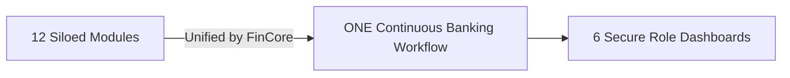
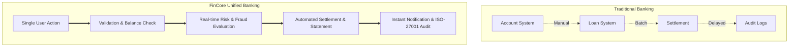
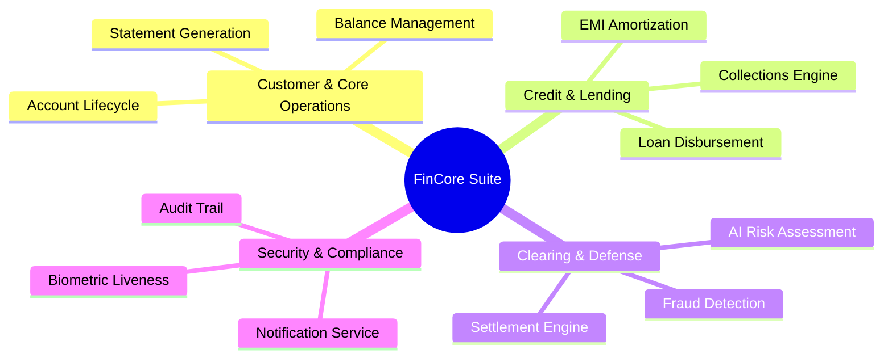
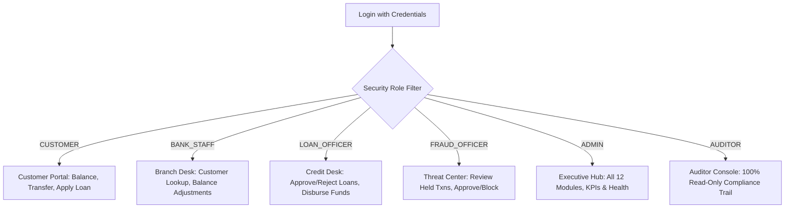
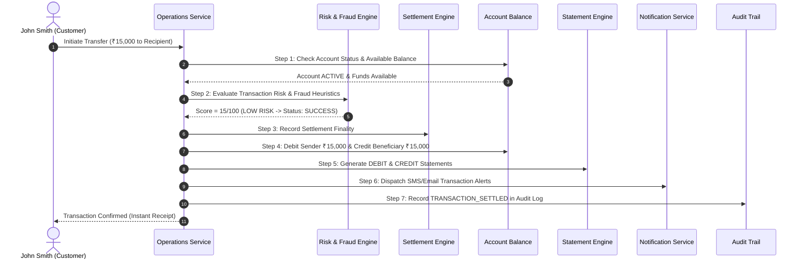
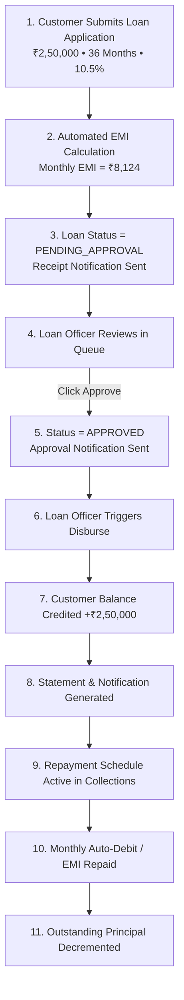
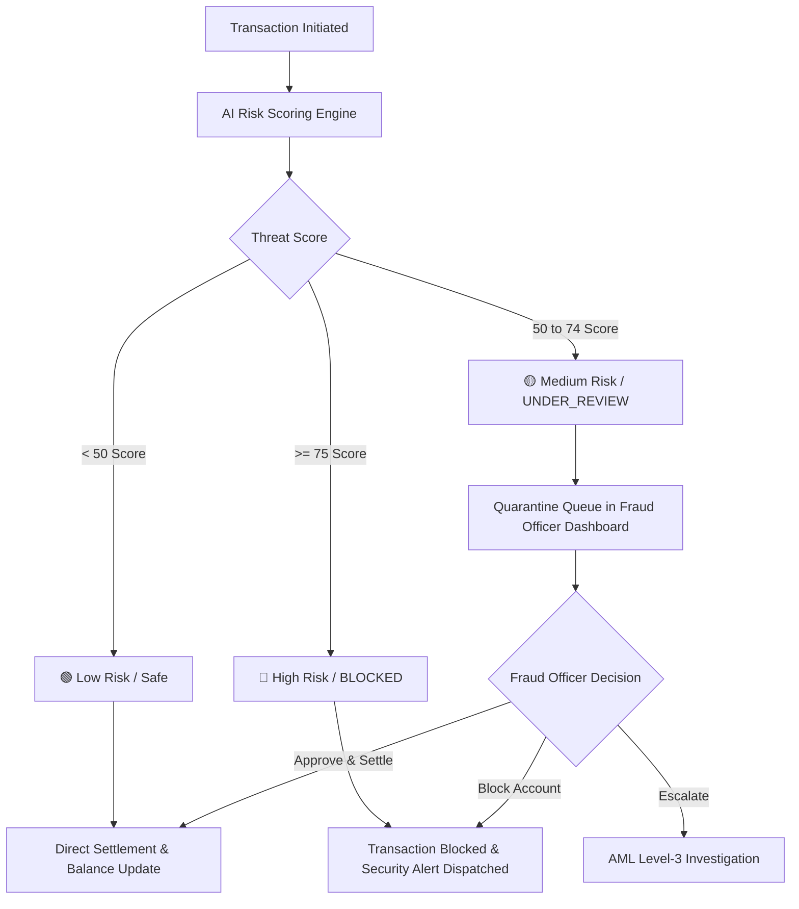
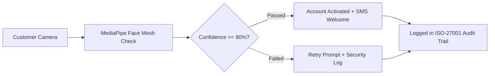

# FinCore Digital Banking Platform
## Comprehensive Presentation Report & System Architecture

---

## 🎯 Presentation Overview & Structure

This report presents the **FinCore Digital Banking Management System** in a structured, slide-by-slide executive format. 
Each section contains:
1. **Core Concept & Objectives**
2. **Visual Flowcharts & Architecture Diagrams**
3. **Structured Breakdown & Plain-English Explanations**
4. **Step-by-Step Technical Sequence**

---

# SECTION 1: Project Title & Vision

### 📌 Vision
- **Project Name:** FinCore Digital Banking Management System
- **Category:** Enterprise Digital Banking Platform with Multi-Module RBAC
- **Primary Objective:** Unify 12 traditionally isolated banking modules into **ONE continuous, automated workflow**.



### Key Highlights
- **Single-Pane Experience:** All core operations, credit servicing, fraud detection, and compliance auditing operate under a synchronized backend ecosystem.
- **Zero Manual Handoffs:** Actions taken by customers or bank officers automatically trigger upstream and downstream services in real time.

---

# SECTION 2: Problem Statement & Solution Matrix

### 📌 The Challenge in Traditional Banking Systems
- **Fragmented Data:** Customer accounts, credit decisions, and settlement ledgers live in separate silos.
- **Delayed Settlements:** Interbank clearing and statement generation often run on slow batch jobs.
- **Reactive Fraud Defense:** Fraud checks occur after transactions are posted, risking capital loss.
- **Compliance Gaps:** Audit logs are scattered across distinct subsystems without unified cryptographic integrity.



### Solution Comparison Matrix

| Aspect | Legacy Banking Systems | FinCore Digital Banking System |
| :--- | :--- | :--- |
| **System Architecture** | Disconnected independent modules | Unified event-driven continuous pipeline |
| **Balance Management** | Periodic batch sync | Atomic debit/credit with hold reservations |
| **Fraud & Risk** | Post-transaction manual review | Pre-settlement AI scoring (<50ms) with automated quarantine |
| **Loan Servicing** | Multi-day cross-department approvals | Digital application $\rightarrow$ risk scoring $\rightarrow$ 1-click disbursement |
| **Regulatory Compliance** | Dispersed audit logs | Centralized, append-only, SHA-256 verifiable audit trail |

---

# SECTION 3: The 12 Banking Modules Explained



### 📌 Detailed Module Directory

| # | Module Name | Core Functionality | Primary Interconnections |
| :-: | :--- | :--- | :--- |
| **1** | **Account Lifecycle** | Complete account states management (`ACTIVE`, `FROZEN`, `CLOSED`), onboarding, and KYC verification. | Liveness, Balance, Statements, Audit |
| **2** | **Balance Management** | Real-time multi-account ledgers, minimum balance holds, overdraft facilities, and branch adjustments. | Transactions, Settlement, Statements |
| **3** | **Statement Generation** | Automated chronological ledger generation, balance-after calculations, and PDF/Excel export. | Transactions, Balance, Notifications |
| **4** | **Risk Assessment** | AI heuristic engine scoring transaction amounts, cross-border anomalies, velocity spikes, and device signatures. | Fraud Detection, Transactions, Audit |
| **5** | **Fraud Detection** | Real-time scoring ($0-100$); automated quarantine queue (`UNDER_REVIEW`), officer resolution workflows. | Risk, Settlement, Notifications |
| **6** | **Settlement Engine** | Interbank RTGS/NEFT clearing, bilateral netting calculations, and final transaction ledger settlement. | Transactions, Balance, Ledger |
| **7** | **Biometric Liveness** | Face analysis and anti-spoofing detection validating customer identity during onboarding. | Account Lifecycle, KYC, Audit |
| **8** | **Audit Trail** | ISO-27001 compliant, append-only chronological log recording all platform events and actor metadata. | All 12 Modules (Global Interceptor) |
| **9** | **Notification Service** | Centralized multi-channel messaging engine dispatching transactional SMS and email notifications. | All 12 Modules |
| **10** | **EMI Calculation** | Standard reducing-balance mathematical engine computing amortization schedules, interest, and principal. | Loan Applications, Servicing |
| **11** | **Loan Disbursement** | Automated RTGS/NEFT tranche release directly crediting customer accounts upon loan officer approval. | Balance, Statements, Notifications |
| **12** | **Collections Engine** | Auto-debit processing, payment receipts, loan balance reductions, delinquency tracking, and overdue penalties. | Loans, Balance, Statements, Audit |

---

# SECTION 4: 6 User Roles & Role-Based Access Control (RBAC)



### 📌 Role Capabilities & Security Isolation

| Role | Target User | Capabilities & Permissions | Security Enforcement |
| :--- | :--- | :--- | :--- |
| **`CUSTOMER`** | Retail Customer | View personal accounts, transfer money, apply for loans, view EMI schedules, download statements. | Scope limited strictly to authenticated customer ID. |
| **`BANK_STAFF`** | Branch Employee | Onboard customers, adjust counter cash balances, freeze/unfreeze accounts, assisted transfers. | Cannot approve loan requests or alter fraud thresholds. |
| **`LOAN_OFFICER`** | Credit Specialist | Review loan applications, inspect applicant risk scores, approve/reject loans, disburse funds. | Cannot modify customer balances without an approved loan sanction. |
| **`FRAUD_OFFICER`** | Risk Analyst | Investigate quarantined transactions, approve held transfers, block fraudulent accounts, escalate to AML. | Focuses exclusively on threat quarantine and anomaly queues. |
| **`ADMIN`** | IT / Bank Executive | Full enterprise dashboard, system KPIs, portfolio distribution, operational diagnostics. | Unrestricted platform visibility across all 12 modules. |
| **`AUDITOR`** | Compliance Inspector | Inspect cross-module audit logs, verify SHA-256 ledger integrity, export ISO-27001 reports. | **Strictly Read-Only**; backend filter rejects any state mutations with HTTP 403 Forbidden. |

---

# SECTION 5: Continuous Workflow #1: Fund Transfer & Settlement



### Step-by-Step Sequence
1. **User Action:** Customer initiates an instant transfer.
2. **Account Validation:** Verifies sender account is `ACTIVE` and available balance $\ge$ transfer amount.
3. **AI Risk Scoring:** Assesses transaction amount, destination, velocity, and device signature.
4. **Settlement Engine:** Low-risk transfers are cleared and posted to the interbank settlement register.
5. **Atomic Balance Update:** Debits sender account and credits beneficiary account simultaneously.
6. **Statement Generation:** Records immutable chronological statement entries for both accounts.
7. **Notification:** Central notification service fires automated SMS and email notifications.
8. **Audit Trail:** Logs timestamp, user ID, actor, IP address, and transaction reference.

---

# SECTION 6: Continuous Workflow #2: Digital Loan Lifecycle



### Step-by-Step Sequence
1. **Application Submission:** Customer chooses loan product, amount, tenure, and purpose.
2. **Amortization Calculation:** Reducing-balance engine generates monthly EMI, interest total, and installment schedule.
3. **Queue Ingestion:** Application enters `PENDING_APPROVAL` status and notifies the borrower.
4. **Officer Review:** Loan Officer reviews credit assessment in the dashboard queue and clicks **Approve**.
5. **Tranche Disbursement:** Officer clicks **Disburse**; the system validates approval status and credits funds directly into the customer's account balance.
6. **Statement & Servicing:** Inserts a credit statement entry, notifies the customer, and activates monthly collections tracking.

---

# SECTION 7: Continuous Workflow #3: Fraud Detection & Quarantine



### Step-by-Step Sequence
1. **Anomaly Detection:** Flagged when transfers involve foreign endpoints, large amount spikes ($\ge ₹1,00,000$), or multiple failed authentication attempts.
2. **Automated Quarantine:** Transactions with risk scores between $50 - 74$ enter `UNDER_REVIEW`. No money leaves the sender's account.
3. **Fraud Officer Queue:** Transaction appears in the Fraud Officer Threat Center with itemized risk triggers.
4. **Officer Decisions:**
   - **Approve to Settle:** Clears quarantine, releases funds, debits balance, generates statements, and notifies the customer.
   - **Block Account / Txn:** Permanently blocks transfer, freezes compromised accounts, and notifies the customer.
   - **Escalate to AML:** Flags case for Level-3 Anti-Money Laundering review.

---

# SECTION 8: Continuous Workflow #4: Biometric Liveness & Compliance



### 📌 Audit Trail Record Anatomy
Every audit entry captures:
- **Timestamp:** ISO-8601 millisecond resolution (`2026-09-16T17:15:20.142Z`).
- **Actor:** User ID / Username / Role (`CUSTOMER`, `LOAN_OFFICER`, `FRAUD_ENGINE`).
- **Action:** Event type (`TRANSACTION_SETTLED`, `LOAN_APPROVED`, `LIVENESS_PASSED`).
- **Module:** Source system (`OPERATIONS`, `FRAUD_DETECTION`, `LOAN_MANAGEMENT`).
- **Entity:** Affected record ID (`ACC-8849-1001`, `LN10001`, `TXN-8849-01`).
- **Network Metadata:** Client IP and browser fingerprint.

---

# SECTION 9: Technical Architecture & Implementation Stack

```
┌───────────────────────────────────────────────────────────────────────────┐
│                           FRONTEND PRESENTATION                           │
│     Angular 18 (Standalone Components • Signals API • Reactive Forms)     │
│             Role-Tailored Dashboards • Dark Theme Design System           │
└─────────────────────────────────────┬─────────────────────────────────────┘
                                      │ REST API (JSON) + Role Headers
                                      ▼
┌───────────────────────────────────────────────────────────────────────────┐
│                        SECURITY & AUTHORIZATION GATE                      │
│        RoleAuthorizationFilter • AuthInterceptor • CORS Configuration     │
│             Strict Auditor Read-Only Enforcement (403 Gate)               │
└─────────────────────────────────────┬─────────────────────────────────────┘
                                      │
                                      ▼
┌───────────────────────────────────────────────────────────────────────────┐
│                          BUSINESS SERVICE PIPELINE                        │
│   OperationsService • FraudDetectionService • SettlementService           │
│   DisbursementService • NotificationService • AuditLogService             │
└─────────────────────────────────────┬─────────────────────────────────────┘
                                      │ Spring Data JPA / Hibernate
                                      ▼
┌───────────────────────────────────────────────────────────────────────────┐
│                          DATABASE PERSISTENCE LAYER                       │
│                         PostgreSQL Relational Storage                     │
│    accounts • transactions • loans • loan_disbursements • audit_logs ...  │
└───────────────────────────────────────────────────────────────────────────┘
```

### Core Technologies
- **Backend:** Spring Boot 3.x, Java 23, Spring Security filters
- **Database & Persistence:** PostgreSQL, Spring Data JPA, Hibernate, `@Transactional` boundaries
- **Frontend:** Angular 18 (Standalone Components, Signals API, RxJS)
- **Security & RBAC:** Role header gates, SHA-256 verifiable logs, 403 Forbidden mutation blocks

---

# SECTION 10: Step-by-Step Live Demonstration Guide

### 📌 Demonstration Checklist

| Step | Role / Persona | Action to Perform | Expected System Response |
| :-: | :--- | :--- | :--- |
| **1** | **Role Switching** | Click 1-Click login pills (`CUSTOMER` $\rightarrow$ `LOAN_OFFICER` $\rightarrow$ `AUDITOR`). | Header role pill, badge color, and sidebar navigation dynamically reconfigure. |
| **2** | **Customer Transfer** | Login as `CUSTOMER` (`John Smith`), click **⚡ Send Money**, transfer ₹15,000. | Sender balance drops by ₹15,000; statement entry created; notification dispatched; audit entry logged. |
| **3** | **Apply for Loan** | As `CUSTOMER`, click **📝 Apply Loan** for ₹2,50,000 (36 months). | Loan created in `PENDING_APPROVAL`; amortization schedule computed. |
| **4** | **Approve & Disburse** | Switch to `LOAN_OFFICER` (`David Miller`), click **✓ Approve**, then click **💸 Disburse**. | Status transitions to `ACTIVE`; ₹2,50,000 credited to customer balance; statement generated; notification sent. |
| **5** | **Fraud Threat Center** | Switch to `FRAUD_OFFICER` (`Elena Rostova`), launch **🚨 AI Threat Engine**, run evaluation. | Threat score evaluated (85/100, `UNDER_REVIEW`); demonstrates **Approve to Settle** or **Block**. |
| **6** | **Auditor Verification** | Switch to `AUDITOR` (`Marcus Thorne`), view **Live ISO-27001 Audit Trail**. | All actions appear chronologically in immutable feed; all editing actions are blocked. |

---

# SECTION 11: Technical Summary & Key Takeaways

1. **Continuous Pipeline:** Single user triggers automatically execute multi-module pipelines across 12 services without data silos.
2. **Atomic Integrity:** Financial balance debits, credits, and ledger postings are bound by database transactions with zero risk of inconsistent states.
3. **Pre-Settlement Threat Mitigation:** Real-time AI risk engine flags suspicious transactions before money leaves the banking network.
4. **Regulatory Readiness:** Every operation is captured in an append-only, tamper-evident ISO-27001 audit ledger.
