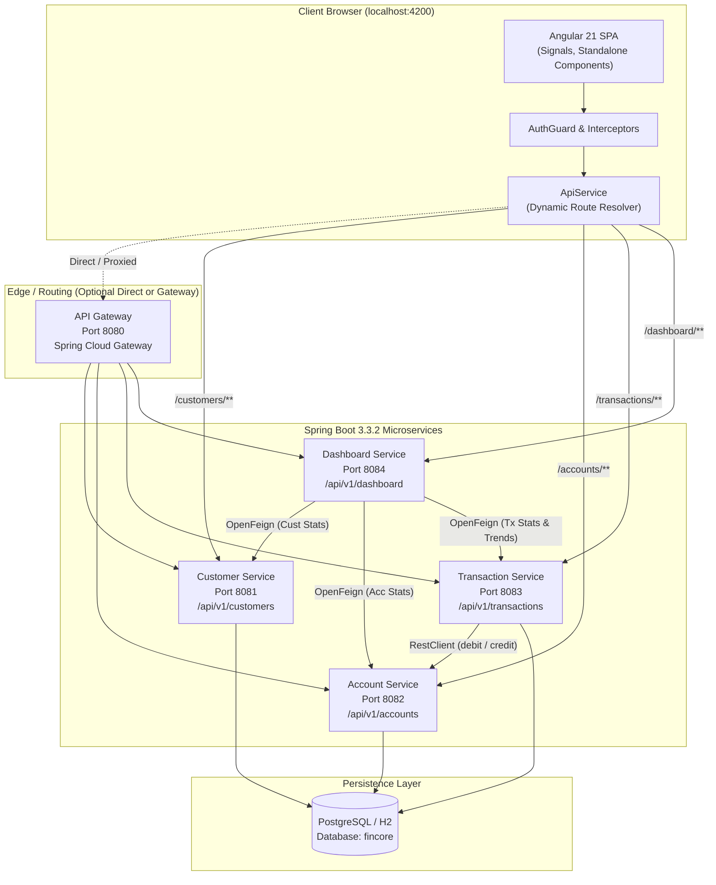

# FinCore Platform — Milestone 1 Architecture & Engineering Specification

> **Source of Truth Document for Milestone 1**  
> *This document provides complete end-to-end technical, architectural, and operational context of the FinCore banking platform. Any AI agent or developer extending or adding new modules to this project must read and follow this specification.*

---

## 1. System Overview & High-Level Architecture

**FinCore** is a modern, distributed digital banking management platform. The system is split into two primary layers:
1. **Backend:** A multi-module Spring Boot 3.3.2 microservices ecosystem managed by Maven, communicating via RESTful APIs, Spring Cloud OpenFeign RPC, and Spring 6 `RestClient`.
2. **Frontend:** An Angular 21 Single Page Application (SPA) utilizing a **zoneless reactive architecture**, Angular Signals, Standalone Components, and Angular Material design tokens.

### 1.1 High-Level Topology



---

## 2. Technology Stack & Dependencies

### 2.1 Backend Stack
* **Java Version:** OpenJDK 17 LTS
* **Framework:** Spring Boot 3.3.2
* **Cloud Orchestration:** Spring Cloud 2023.0.3 (Gateway, OpenFeign)
* **Build Tool:** Maven (Multi-module project with parent POM)
* **Persistence & ORM:** Spring Data JPA / Hibernate Core (DDL auto-update mode)
* **Databases:** PostgreSQL (Primary), H2 Database (In-Memory Development Profile)
* **Documentation:** Springdoc OpenAPI 2.5.0 (`/swagger-ui.html`, `/v3/api-docs`)
* **Validation:** Jakarta Bean Validation (`jakarta.validation.constraints.*`)
* **Object Mapping & Boilerplate:** MapStruct 1.5.5.Final, Project Lombok 1.18.32
* **Monitoring:** Spring Boot Actuator (`/actuator/health`, `/actuator/info`)

### 2.2 Frontend Stack
* **Framework:** Angular 21 (Zoneless reactive architecture, Standalone Components)
* **TypeScript Version:** ~5.9.2
* **Package Manager / Runtime:** npm 11+, Node.js 20+
* **Component Library:** Angular Material 21.2.14, Angular CDK 21.2.14
* **State Management:** Angular Signals (`signal()`, `computed()`, `readonly()`) + RxJS 7.8.0
* **Visualizations & Charts:** Chart.js 4.4.1, ng2-charts 6.0.1
* **Testing & Tools:** Vitest 4.0.8, JSDOM 28.0.0, Prettier 3.8.1

---

## 3. Microservice Catalog & Port Allocation

| Service Identifier | Port | Root Base URL | Core Responsibility | Persistence / Downstream Dependencies |
| :--- | :---: | :--- | :--- | :--- |
| **`fincore-frontend`** | `4200` | `http://localhost:4200` | Zoneless UI, Signals state, route views | Node 20+, Angular Material |
| **`api-gateway`** | `8080` | `http://localhost:8080` | Centralized gateway routing & CORS aggregation | Spring Cloud Gateway |
| **`customer-service`** | `8081` | `http://localhost:8081/api/v1/customers` | Customer onboarding, KYC lifecycle, profiles | PostgreSQL (`customers` table) |
| **`account-service`** | `8082` | `http://localhost:8082/api/v1/accounts` | Account creation, status, credit/debit logic | PostgreSQL (`accounts` table) |
| **`transaction-service`** | `8083` | `http://localhost:8083/api/v1/transactions` | Deposits, withdrawals, transfers, ledger | PostgreSQL (`transactions` table) + AccountService |
| **`dashboard-service`** | `8084` | `http://localhost:8084/api/v1/dashboard` | Aggregated metrics, charts, activity feed | Feign clients to 8081, 8082, 8083 |

---

## 4. Directory Structure & Responsibilities

```
d:\Desktop\fincore\
├── MILESTONE_1.md                            # Complete Architecture & Engineering Reference (This File)
├── README.md                                 # Platform Quickstart & Developer Guides
│
├── fin-backend/bacjend/                      # Root Maven Multi-Module Project
│   ├── pom.xml                               # Root Parent POM (Spring Boot 3.3.2 & dependency management)
│   │
│   ├── api-gateway/                          # (Port 8080) Central Route Broker
│   │   ├── pom.xml
│   │   └── src/main/
│   │       ├── java/com/fincore/gateway/ApiGatewayApplication.java
│   │       └── resources/application.yml     # Route definitions for 8081-8084 + CORS filters
│   │
│   ├── customer-service/                     # (Port 8081) Customer Domain
│   │   └── src/main/java/com/fincore/customerservice/
│   │       ├── CustomerServiceApplication.java
│   │       ├── config/                       # WebConfig, CorsConfig, SwaggerConfig
│   │       ├── controller/                   # CustomerController (/api/v1/customers)
│   │       ├── dto/                          # CustomerRequest, CustomerResponse, ApiResponse
│   │       ├── entity/                       # Customer JPA Entity
│   │       ├── enums/                        # KycStatus, CustomerStatus
│   │       ├── exception/                    # GlobalExceptionHandler, ResourceNotFoundException
│   │       ├── repository/                   # CustomerRepository (Spring Data JPA)
│   │       └── service/                      # CustomerService, CustomerServiceImpl, CustomerMapper
│   │
│   ├── account-service/                      # (Port 8082) Account Domain
│   │   └── src/main/java/com/bankingapp/accountservice/
│   │       ├── AccountServiceApplication.java
│   │       ├── config/                       # WebConfig, CorsConfig
│   │       ├── controller/                   # AccountController (/api/v1/accounts)
│   │       ├── dto/                          # AccountCreateRequest, AccountResponse, Statistics
│   │       ├── entity/                       # Account JPA Entity
│   │       ├── enums/                        # AccountType, AccountStatus
│   │       ├── exception/                    # GlobalExceptionHandler, InsufficientBalanceException
│   │       ├── repository/                   # AccountRepository
│   │       └── service/                      # AccountService, AccountServiceImpl
│   │
│   ├── transaction-service/                  # (Port 8083) Transactions & Ledger Domain
│   │   └── src/main/java/com/fincore/transaction/
│   │       ├── TransactionServiceApplication.java
│   │       ├── client/                       # AccountClient (RestClient for debit/credit operations)
│   │       ├── config/                       # RestClientConfig, CorsConfig
│   │       ├── controller/                   # TransactionController (/api/v1/transactions)
│   │       ├── dto/                          # DepositRequest, WithdrawRequest, TransferRequest
│   │       ├── entity/                       # Transaction JPA Entity
│   │       ├── enums/                        # TransactionType, TransactionStatus
│   │       ├── exception/                    # GlobalExceptionHandler, TransactionException
│   │       ├── repository/                   # TransactionRepository
│   │       └── service/                      # TransactionService, TransactionServiceImpl
│   │
│   └── dashboard-service/                    # (Port 8084) Analytics & Aggregation Engine
│       └── src/main/java/com/fincore/dashboard/
│           ├── DashboardServiceApplication.java
│           ├── client/                       # CustomerClient, AccountClient, TransactionClient (Feign)
│           ├── controller/                   # DashboardController (/api/v1/dashboard)
│           ├── dto/                          # DashboardSummaryResponse, SummaryCardResponse, Charts
│           ├── exception/                    # FeignErrorDecoder, FallbackHandlers
│           └── service/                      # DashboardService, DashboardServiceImpl
│
└── fin-final/fincore-frontend/               # Angular 21 Standalone Reactive Application
    ├── package.json                          # Angular 21, Material 21, Chart.js dependencies
    └── src/
        ├── environments/                     # environment.ts (Microservice base URL catalog)
        └── app/
            ├── core/                         # Singleton infrastructure
            │   ├── constants/                # API_ENDPOINTS, STORAGE_KEYS
            │   ├── guards/                   # auth.guard.ts, role.guard.ts
            │   ├── interceptors/             # auth.interceptor.ts, error.interceptor.ts
            │   ├── models/                   # auth.models.ts, api.models.ts
            │   ├── services/                 # api.service.ts, auth.service.ts, backend-status.service.ts
            │   └── utils/                    # storage.util.ts
            ├── layout/                       # App layout shell, Header, Sidebar, Footer
            ├── features/                     # Feature domain components
            │   ├── authentication/           # Login screen & session bootstrap
            │   ├── dashboard/                # Analytics widgets, KPI cards, dynamic charts
            │   ├── customer/                 # Customer list, KYC verification dialog, forms
            │   ├── account/                  # Account list, creation dialog, status toggles
            │   ├── transaction/              # Ledger history, deposit/withdraw/transfer wizards
            │   └── errors/                   # 404 Not Found, 403 Forbidden views
            └── shared/                       # Shared UI components, badges, custom pipes
```

---

## 5. Domain Modules & Business Logic Breakdown

### 5.1 Customer Service (`Port 8081`)
* **Identifiers:** Auto-generates unique Customer Numbers formatted as `CUST-XXXXXX`.
* **KYC Lifecycle:** Transitions through `PENDING` $\rightarrow$ `VERIFIED` or `REJECTED`.
* **Search & Filters:** Real-time search across first name, last name, and email with Spring Data pagination (`Pageable`).
* **Validation Rules:**
  * National ID (`nationalId`): Unique, mandatory.
  * Email (`email`): Valid email format, unique.
  * Phone Number (`phoneNumber`): Required.
* **Response Pattern:** Envelopes all payloads inside `ApiResponse<T>` (`{ success: true, message: "...", data: T, timestamp: "..." }`).

### 5.2 Account Service (`Port 8082`)
* **Identifiers:** Auto-generates unique Account Numbers formatted as `ACC-XXXXXX`.
* **Account Types:** `SAVINGS`, `CHECKING`, `BUSINESS`, `LOAN`.
* **Status Lifecycle:** `ACTIVE` $\leftrightarrow$ `INACTIVE` $\leftrightarrow$ `SUSPENDED` $\rightarrow$ `CLOSED`.
* **Balance Operations:**
  * `POST /api/v1/accounts/{accountNumber}/credit?amount=X` — Safely adds funds to balance.
  * `POST /api/v1/accounts/{accountNumber}/debit?amount=X` — Checks balance $\ge$ amount; throws `InsufficientBalanceException` if balance is inadequate; decreases balance.
* **Customer Link:** Accounts store `customerId` referencing the owning customer.

### 5.3 Transaction Service (`Port 8083`)
* **Transaction Types:** `DEPOSIT`, `WITHDRAWAL`, `TRANSFER_OUT`, `TRANSFER_IN`.
* **Transaction Status:** `PENDING`, `COMPLETED`, `FAILED`, `CANCELLED`.
* **Inter-Service Transfer Protocol:**
  1. Validates source and destination account numbers are distinct and amount $> 0$.
  2. Calls `AccountService: debit(sourceAccount, amount)`.
  3. On debit success, calls `AccountService: credit(destinationAccount, amount)`.
  4. If credit fails, initiates an automated compensating credit to refund the source account.
  5. Inserts two ledger entries (`TRANSFER_OUT` for sender, `TRANSFER_IN` for recipient) ensuring double-entry balance consistency.

### 5.4 Dashboard Aggregation Service (`Port 8084`)
* **Role:** Backend-for-Frontend (BFF) aggregator.
* **Downstream Feign RPC:**
  * Queries `CustomerService: /statistics` $\rightarrow$ Total customers, pending KYC count.
  * Queries `AccountService: /statistics` $\rightarrow$ Total accounts, active accounts, aggregate balance volume.
  * Queries `TransactionService: /statistics` & `/recent` $\rightarrow$ Daily volume, recent 10 transactions.
* **Fault Tolerance:** Catches Feign exceptions per service call, providing zero-value fallbacks so the dashboard UI never breaks when one downstream service is restarting.

---

## 6. Comprehensive API Specification

### 6.1 Customer Service (`http://localhost:8081`)

| Method | Endpoint | Description | Request Body | Response Payload |
| :--- | :--- | :--- | :--- | :--- |
| `POST` | `/api/v1/customers` | Register new customer | `CustomerRequest` | `ApiResponse<CustomerResponse>` (201 Created) |
| `GET` | `/api/v1/customers/{id}` | Get customer by Database ID | — | `ApiResponse<CustomerResponse>` (200 OK) |
| `GET` | `/api/v1/customers/number/{customerNumber}` | Get customer by `CUST-XXXXXX` | — | `ApiResponse<CustomerResponse>` (200 OK) |
| `GET` | `/api/v1/customers` | Paginated customer list | Params: `page`, `size`, `sort` | `ApiResponse<Page<CustomerResponse>>` (200 OK) |
| `GET` | `/api/v1/customers/kyc-status/{kycStatus}` | Filter by KYC status | Path: `PENDING|VERIFIED|REJECTED` | `ApiResponse<Page<CustomerResponse>>` (200 OK) |
| `GET` | `/api/v1/customers/search` | Search by customer name | Param: `name` | `ApiResponse<Page<CustomerResponse>>` (200 OK) |
| `PUT` | `/api/v1/customers/{id}` | Full customer profile update | `CustomerRequest` | `ApiResponse<CustomerResponse>` (200 OK) |
| `PATCH`| `/api/v1/customers/{id}/kyc-status` | Update KYC status | `KycStatusUpdateRequest` | `ApiResponse<CustomerResponse>` (200 OK) |
| `GET` | `/api/v1/customers/statistics` | Customer metrics for dashboard | — | `CustomerStatisticsResponse` (200 OK) |
| `DELETE`| `/api/v1/customers/{id}` | Delete customer record | — | `ApiResponse<Void>` (200 OK) |

### 6.2 Account Service (`http://localhost:8082`)

| Method | Endpoint | Description | Request Body | Response Payload |
| :--- | :--- | :--- | :--- | :--- |
| `POST` | `/api/v1/accounts` | Create new bank account | `AccountCreateRequest` | `AccountResponse` (201 Created) |
| `GET` | `/api/v1/accounts/{id}` | Get account by Database ID | — | `AccountResponse` (200 OK) |
| `GET` | `/api/v1/accounts/number/{accountNumber}` | Get account by `ACC-XXXXXX` | — | `AccountResponse` (200 OK) |
| `GET` | `/api/v1/accounts` | Query & filter accounts | Params: `customerId`, `search`, `status`, `accountType` | `List<AccountResponse>` (200 OK) |
| `PUT` | `/api/v1/accounts/{id}` | Update account metadata | `AccountUpdateRequest` | `AccountResponse` (200 OK) |
| `PATCH`| `/api/v1/accounts/{id}/status` | Change account status | `AccountStatusUpdateRequest` | `AccountResponse` (200 OK) |
| `POST` | `/api/v1/accounts/{accountNumber}/credit` | Add funds to account | Param: `amount` (BigDecimal) | `AccountResponse` (200 OK) |
| `POST` | `/api/v1/accounts/{accountNumber}/debit` | Deduct funds from account | Param: `amount` (BigDecimal) | `AccountResponse` (200 OK) |
| `GET` | `/api/v1/accounts/statistics` | Account statistics | — | `AccountStatisticsResponse` (200 OK) |
| `DELETE`| `/api/v1/accounts/{id}` | Close/Delete account | — | `String` confirmation (200 OK) |

### 6.3 Transaction Service (`http://localhost:8083`)

| Method | Endpoint | Description | Request Body | Response Payload |
| :--- | :--- | :--- | :--- | :--- |
| `POST` | `/api/v1/transactions/deposit` | Cash/wire deposit | `DepositRequest` | `TransactionResponse` (200 OK) |
| `POST` | `/api/v1/transactions/withdraw` | Cash/ATM withdrawal | `WithdrawRequest` | `TransactionResponse` (200 OK) |
| `POST` | `/api/v1/transactions/transfer` | Account-to-account transfer | `TransferRequest` | `TransactionResponse` (200 OK) |
| `POST` | `/api/v1/transactions` | Generic transaction creation | `CreateTransactionRequest` | `TransactionResponse` (200 OK) |
| `GET` | `/api/v1/transactions` | Paginated search with filters | Params: `search`, `type`, `status`, `minAmount`, `maxAmount`, `startDate`, `endDate`, `page`, `size` | `Page<TransactionResponse>` (200 OK) |
| `GET` | `/api/v1/transactions/{id}` | Get transaction by ID | — | `TransactionResponse` (200 OK) |
| `GET` | `/api/v1/transactions/history/{accountNumber}` | Get statement for account | Params: `page`, `size` | `Page<TransactionResponse>` (200 OK) |
| `GET` | `/api/v1/transactions/recent` | Recent transactions | Param: `limit` (default 10) | `Page<TransactionResponse>` (200 OK) |
| `GET` | `/api/v1/transactions/statistics` | Transaction metrics | — | `TransactionStatisticsResponse` (200 OK) |

### 6.4 Dashboard Service (`http://localhost:8084`)

| Method | Endpoint | Description | Response Payload |
| :--- | :--- | :--- | :--- |
| `GET` | `/api/v1/dashboard/summary-cards` | Top 4 KPI summary cards | `List<SummaryCardResponse>` |
| `GET` | `/api/v1/dashboard/summary` | Combined dashboard overview | `DashboardSummaryResponse` |
| `GET` | `/api/v1/dashboard/recent-transactions` | Latest transaction feed | `PageResponse<TransactionResponse>` |
| `GET` | `/api/v1/dashboard/notifications` | System alerts & warnings | `List<NotificationResponse>` |
| `GET` | `/api/v1/dashboard/activity-timeline` | System audit activity stream | `List<ActivityResponse>` |
| `GET` | `/api/v1/dashboard/charts/monthly-transactions` | Monthly volume chart data | `DashboardChartDataResponse` |
| `GET` | `/api/v1/dashboard/charts/deposits-vs-withdrawals` | Deposit vs. withdrawal ratios | `DashboardChartDataResponse` |
| `GET` | `/api/v1/dashboard/charts/customer-growth` | Customer acquisition curve | `DashboardChartDataResponse` |

---

## 7. Persistence & Database Schema

### 7.1 Database Connection
* **Database Name:** `fincore`
* **Default Port:** `5432`
* **Default Credentials:** User `postgres`, Password `root123`
* **Schema Management:** Automated Hibernate schema generation (`spring.jpa.hibernate.ddl-auto: update`).

### 7.2 Tables & Entity Relationships

```
                     ┌───────────────────────────┐
                     │         CUSTOMERS         │
                     ├───────────────────────────┤
                     │ id (PK, BIGSERIAL)        │
                     │ customer_number (UNIQUE)  │◄────────┐
                     │ first_name, last_name     │         │
                     │ email (UNIQUE), phone     │         │ Logical
                     │ national_id (UNIQUE)      │         │ Reference
                     │ kyc_status, status        │         │ (customerId)
                     │ created_at, updated_at    │         │
                     └─────────────┬─────────────┘         │
                                   │                       │
                                   │ 1:N                   │
                                   ▼                       │
                     ┌───────────────────────────┐         │
                     │         ACCOUNTS          │         │
                     ├───────────────────────────┤         │
                     │ id (PK, BIGSERIAL)        │         │
                     │ account_number (UNIQUE)   │         │
                     │ customer_id (FK) ─────────┴─────────┘
                     │ account_type, status      │
                     │ balance (NUMERIC 15, 2)   │
                     │ currency (e.g. USD)       │
                     │ created_at, updated_at    │
                     └─────────────┬─────────────┘
                                   │
                                   │ Referenced by account_number
                                   ▼
                     ┌───────────────────────────┐
                     │       TRANSACTIONS        │
                     ├───────────────────────────┤
                     │ id (PK, VARCHAR / UUID)   │
                     │ transaction_type          │
                     │ amount (NUMERIC 15, 2)    │
                     │ source_account            │
                     │ destination_account       │
                     │ status, reference_number  │
                     │ description               │
                     │ timestamp, created_at     │
                     └───────────────────────────┘
```

---

## 8. Authentication, Authorization & Security

### 8.1 Frontend Reactive Session (`AuthService`)
* **State Management:** Uses Angular Signal `currentUserSignal = signal<User | null>(...)`.
* **RBAC Role Matrix:**
  * **`Role.ADMIN`**: Full permissions (`*`) across all views, creation forms, status updates, and deletions.
  * **`Role.EMPLOYEE`**: Operator access (`view:dashboard`, `view:customers`, `edit:customers`, `view:accounts`, `edit:accounts`, `view:transactions`, `edit:transactions`).
  * **`Role.CUSTOMER`**: Self-service portal (`view:dashboard`, `view:accounts`, `view:transactions`).
* **Demo Profiles (Local Dev Quick Access):**
  * `admin` / `password` $\rightarrow$ Administrator
  * `employee` / `password` $\rightarrow$ Bank Officer
  * `customer` / `password` $\rightarrow$ Customer User

### 8.2 Frontend HTTP Interception (`AuthInterceptor`)
* Intercepts all outgoing HTTP requests from `ApiService` / `HttpClient`.
* Appends `Authorization: Bearer <token>` from local session storage.
* Handles HTTP 401 / 403 globally via `ErrorInterceptor` to redirect to `/login`.

### 8.3 Dynamic URL Routing (`ApiService.buildUrl`)
* The frontend does not hardcode port numbers in components.
* `ApiService.buildUrl(path)` dynamically resolves:
  * `/customers/**` $\rightarrow$ `environment.apiBaseUrls.customer` (Port 8081)
  * `/accounts/**` $\rightarrow$ `environment.apiBaseUrls.account` (Port 8082)
  * `/transactions/**` $\rightarrow$ `environment.apiBaseUrls.transaction` (Port 8083)
  * `/dashboard/**` $\rightarrow$ `environment.apiBaseUrls.dashboard` (Port 8084)

---

## 9. Coding Standards & Conventions

Future modules must follow these established patterns:

### 9.1 Backend Conventions
1. **Package Hierarchy:** `com.fincore.<module_name>` (e.g. `com.fincore.loan`, `com.fincore.card`).
2. **Layering:**
   * `controller` $\rightarrow$ RestControllers exposing endpoints with `@Valid` on request bodies.
   * `service` $\rightarrow$ Service interface (`XService`) and implementation class (`XServiceImpl`) with `@Transactional`.
   * `repository` $\rightarrow$ Spring Data `JpaRepository<Entity, ID>`.
   * `entity` $\rightarrow$ JPA `@Entity` using Lombok `@Data`, `@Builder`, `@NoArgsConstructor`, `@AllArgsConstructor`.
   * `dto` $\rightarrow$ Plain Java records/classes for requests and responses with Jakarta validation annotations (`@NotBlank`, `@NotNull`, `@Positive`, etc.).
   * `exception` $\rightarrow$ Domain-specific exceptions + `@RestControllerAdvice` `GlobalExceptionHandler` returning consistent error responses.
3. **Dependency Injection:** Use constructor injection via Lombok `@RequiredArgsConstructor` on classes with `private final` dependencies.
4. **Mapping:** Use MapStruct interfaces (`@Mapper(componentModel = "spring")`) for entity-to-DTO transformations.

### 9.2 Frontend Conventions
1. **Angular 21 Standalone:** All components, directives, and pipes must be `standalone: true`.
2. **Signals over Manual Subscriptions:** Use `signal()`, `computed()`, and `toSignal()` for reactive component state instead of manually subscribing to observables in component templates.
3. **Styling & Tokens:** Use CSS variables (`var(--primary)`, `var(--surface)`, `var(--border)`) and SCSS modules.
4. **Forms:** Typed Reactive Forms (`FormGroup`, `FormControl`, `Validators`).

---

## 10. Operational Runbook (How to Run Milestone 1)

### 10.1 Backend Microservices Run Guide

From the root directory `d:\Desktop\fincore\fin-backend\bacjend`:

```powershell
# Build entire parent project and verify tests
cd d:\Desktop\fincore\fin-backend\bacjend
.\mvnw.cmd clean test
```

To run all services concurrently, open separate PowerShell terminals:

```powershell
# Terminal 1: Customer Service (8081)
cd d:\Desktop\fincore\fin-backend\bacjend\customer-service
..\mvnw.cmd spring-boot:run

# Terminal 2: Account Service (8082)
cd d:\Desktop\fincore\fin-backend\bacjend\account-service
..\mvnw.cmd spring-boot:run

# Terminal 3: Transaction Service (8083)
cd d:\Desktop\fincore\fin-backend\bacjend\transaction-service
..\mvnw.cmd spring-boot:run

# Terminal 4: Dashboard Service (8084)
cd d:\Desktop\fincore\fin-backend\bacjend\dashboard-service
..\mvnw.cmd spring-boot:run

# Terminal 5 (Optional): API Gateway (8080)
cd d:\Desktop\fincore\fin-backend\bacjend\api-gateway
..\mvnw.cmd spring-boot:run
```

### 10.2 Frontend Run Guide

```powershell
# Terminal 6: Angular Frontend (4200)
cd d:\Desktop\fincore\fin-final\fincore-frontend
npm install
npm start
```
Access the application at `http://localhost:4200`.

### 10.3 Health Check Verification
```bash
curl -s http://localhost:8081/actuator/health
curl -s http://localhost:8082/actuator/health
curl -s http://localhost:8083/actuator/health
curl -s http://localhost:8084/actuator/health
```

---

## 11. Mandatory Rules for Future Module Development

When implementing any future module (e.g. Card Management, Loan Engine, Notifications, Audit Ledger):

1. **Follow the 6-Step Implementation Flow:**
   * Step 1: Provide a concise implementation plan (Module name, Files to Create, Files to Modify, API list, Database schema changes, Integration points).
   * Step 2: Ensure the user approves the plan before executing code modifications.
   * Step 3: Implement domain models, repositories, services, DTOs, and controllers following Milestone 1 standards.
   * Step 4: Add the new service route in `api.service.ts` (`buildUrl`) and `environment.ts`.
   * Step 5: Implement reactive standalone UI features using Angular Signals and Material 21.
   * Step 6: Verify compilation with `mvnw test` / `ng build` and provide a walkthrough summary.
2. **Never break existing APIs or DB schemas:** Maintain backward compatibility for existing endpoints (`/customers/**`, `/accounts/**`, `/transactions/**`, `/dashboard/**`).
3. **Isolate microservice data:** Do not create cross-database SQL joins. Communicate between microservices using OpenFeign or `RestClient`.
4. **Handle compensation on failure:** Any distributed financial operation spanning multiple services must handle failure compensation (reversal/rollback).

---

**Milestone 1 Architecture Specification Complete. Ready for future module implementation.**
