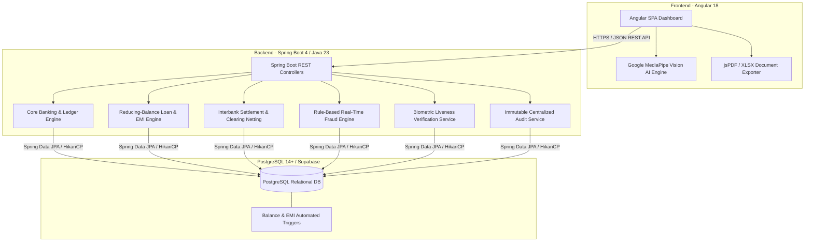

# 🏦 FinCore - Next-Gen Digital Banking & Settlement Platform

**FinCore** is an enterprise-grade digital banking and settlement platform engineered with a high-performance multi-tier architecture. It integrates **Angular 18** for a responsive single-page banking portal, **Java 23 & Spring Boot 4** for high-throughput business and risk engines, and **PostgreSQL** for ACID-compliant double-entry ledgers, loan amortization schedules, and immutable security audit trails.

---

## 📑 Table of Contents
1. [System Architecture](#-system-architecture)
2. [Database Architecture & Full ER Diagram](#-database-architecture--full-er-diagram)
   - [Full Mermaid ER Diagram](#full-mermaid-er-diagram)
   - [Database Entities & Schema Breakdown](#database-entities--schema-breakdown)
   - [Automated Triggers & Stored Procedures](#automated-triggers--stored-procedures)
   - [Database Setup & Execution](#database-setup--execution)
3. [Backend Architecture & API Reference](#-backend-architecture--api-reference)
   - [Technology Stack](#backend-technology-stack)
   - [Core Business Engines & Logic](#core-business-engines--logic)
   - [Complete REST API Reference](#complete-rest-api-reference)
   - [Backend Configuration & Execution](#backend-configuration--execution)
4. [Frontend Architecture & UI Modules](#-frontend-architecture--ui-modules)
   - [Technology Stack](#frontend-technology-stack)
   - [UI Modules & Routing Index](#ui-modules--routing-index)
   - [Specialized Features (MediaPipe AI, PDF/Excel Exports)](#specialized-features)
   - [Frontend Setup & Execution](#frontend-setup--execution)
5. [End-to-End Quickstart Guide](#-end-to-end-quickstart-guide)
6. [Repository & Git Setup](#-repository--git-setup)

---

## 🏛 System Architecture

FinCore implements a decoupled client-server architecture with strict separation of concerns:



---

## 🗄 Database Architecture & Full ER Diagram

The database layer runs on **PostgreSQL** and enforces referential integrity, check constraints, automatic balance triggers, and audit histories.

### Full Mermaid ER Diagram

```mermaid
erDiagram
    CUSTOMERS ||--o{ ACCOUNTS : "owns (1:N)"
    CUSTOMERS ||--o{ LOANS : "applies_for (1:N)"
    CUSTOMERS ||--o{ EMI_COLLECTIONS : "pays (1:N)"
    CUSTOMERS ||--|| CUSTOMER_SECURITY_CREDENTIALS : "has (1:1)"
    CUSTOMERS ||--o{ LIVENESS_VERIFICATION : "verifies (1:N)"
    CUSTOMERS ||--o{ NOTIFICATIONS : "receives (1:N)"
    CUSTOMERS ||--o{ FRAUD_EVENTS : "flagged_in (1:N)"
    CUSTOMERS ||--o{ RISK_ASSESSMENT : "assessed_for (1:N)"

    ACCOUNTS ||--o{ TRANSACTION_DETAILS : "executes (1:N)"
    ACCOUNTS ||--o{ STATEMENT_ARCHIVE : "generates (1:N)"
    ACCOUNTS ||--o{ ACCOUNT_STATUS_HISTORY : "tracks (1:N)"
    ACCOUNTS ||--o{ LOANS : "disbursement_target (1:N)"
    ACCOUNTS ||--o{ LOAN_DISBURSEMENT : "receives_funds (1:N)"

    TRANSACTION_DETAILS ||--|| LEDGER : "records_in (1:1)"

    LOANS ||--o{ LOAN_DISBURSEMENT : "disburses_via (1:N)"
    LOANS ||--o{ EMI_SCHEDULE : "amortized_into (1:N)"
    LOANS ||--o{ EMI_COLLECTIONS : "collected_via (1:N)"

    EMI_SCHEDULE ||--o{ EMI_COLLECTIONS : "satisfies (1:N)"

    SETTLEMENT_BATCHES ||--o{ SETTLEMENT : "contains (1:N)"

    CUSTOMERS {
        bigserial customer_id PK
        varchar first_name
        varchar last_name
        varchar full_name
        varchar email UK
        varchar phone UK
        text address
        varchar kyc_status
        date date_of_birth
        timestamptz created_at
    }

    ACCOUNTS {
        bigserial account_id PK
        bigint customer_id FK
        varchar account_number UK
        varchar account_type
        numeric balance
        numeric available_balance
        varchar currency
        varchar status
        numeric min_balance_threshold
        numeric overdraft_limit
        date opening_date
        timestamptz created_at
    }

    TRANSACTION_DETAILS {
        bigserial transaction_id PK
        bigint account_id FK
        varchar transaction_reference UK
        varchar transaction_type
        numeric amount
        varchar description
        varchar transaction_status
        varchar channel
        timestamptz transaction_date
    }

    LEDGER {
        bigserial ledger_id PK
        bigint transaction_id FK
        numeric debit
        numeric credit
        numeric balance_after
        timestamptz ledger_date
    }

    STATEMENT_ARCHIVE {
        bigserial statement_id PK
        bigint account_id FK
        date start_date
        date end_date
        varchar statement_format
        varchar statement_template
        text download_url
        varchar sha256_checksum
        timestamptz generated_at
    }

    ACCOUNT_STATUS_HISTORY {
        bigserial history_id PK
        bigint account_id FK
        varchar old_status
        varchar new_status
        varchar changed_by
        varchar reason
        timestamptz changed_at
    }

    LOANS {
        bigserial loan_id PK
        bigint customer_id FK
        bigint account_id FK
        varchar loan_number UK
        varchar loan_type
        numeric principal_amount
        numeric annual_interest_rate
        integer tenure_months
        numeric monthly_emi
        numeric total_interest
        numeric total_payable
        numeric disbursed_amount
        numeric outstanding_principal
        numeric outstanding_interest
        boolean auto_debit_enabled
        varchar loan_status
        date application_date
        date approval_date
        date disbursement_date
        timestamptz created_at
    }

    LOAN_DISBURSEMENT {
        bigserial disbursement_id PK
        bigint loan_id FK
        bigint account_id FK
        numeric disbursement_amount
        varchar disbursement_channel
        varchar disbursement_status
        varchar reference_number UK
        timestamptz disbursement_date
        text remarks
    }

    EMI_SCHEDULE {
        bigserial emi_id PK
        bigint loan_id FK
        integer emi_number
        date due_date
        numeric opening_principal
        numeric emi_amount
        numeric principal_component
        numeric interest_component
        numeric closing_principal
        numeric paid_amount
        numeric remaining_amount
        varchar emi_status
        date payment_date
    }

    EMI_COLLECTIONS {
        bigserial collection_id PK
        bigint emi_id FK
        bigint loan_id FK
        bigint customer_id FK
        numeric payment_amount
        varchar payment_method
        varchar transaction_reference UK
        varchar collection_status
        timestamptz payment_date
        text remarks
    }

    SETTLEMENT_BATCHES {
        varchar batch_id PK
        varchar clearing_window
        varchar clearing_method
        numeric gross_volume
        numeric net_obligation
        integer transaction_count
        varchar saga_status
        varchar status
        timestamptz settled_at
    }

    SETTLEMENT {
        bigserial settlement_id PK
        varchar batch_id FK
        varchar transaction_reference
        bigint loan_id
        numeric settled_amount
        varchar status
        timestamptz settled_at
    }

    CUSTOMER_SECURITY_CREDENTIALS {
        bigserial credential_id PK
        bigint customer_id FK,UK
        varchar passcode_hash
        integer failed_attempts
        boolean is_locked
        timestamptz last_verified_at
        timestamptz updated_at
    }

    LIVENESS_VERIFICATION {
        bigserial verification_id PK
        bigint customer_id FK
        varchar session_id UK
        numeric confidence_score
        varchar verification_method
        varchar challenges_passed
        varchar status
        text failure_reason
        varchar ip_address
        timestamptz verified_at
        timestamptz created_at
    }

    FRAUD_EVENTS {
        bigserial event_id PK
        bigint customer_id
        varchar transaction_reference
        integer fraud_score
        varchar threat_level
        text reason
        varchar status
        timestamptz created_at
    }

    RISK_ASSESSMENT {
        bigserial assessment_id PK
        bigint customer_id
        varchar transaction_reference
        integer risk_score
        varchar risk_level
        varchar decision
        numeric amount
        varchar transaction_type
        varchar location
        varchar device_type
        boolean international_transaction
        boolean new_device
        integer previous_transaction_count
        text reasons
        text ai_analysis
        timestamptz assessed_at
    }

    NOTIFICATIONS {
        bigserial notification_id PK
        bigint customer_id
        varchar recipient
        varchar channel
        varchar event_type
        text message
        varchar status
        timestamptz sent_at
    }

    AUDIT_LOG {
        bigserial audit_id PK
        bigint user_id
        varchar username
        varchar action
        varchar module
        varchar entity
        varchar entity_id
        text details
        varchar status
        varchar ip
        timestamptz created_at
    }
```



### Database Entities & Schema Breakdown

| Domain | Table Name | Purpose | Key Constraints |
|---|---|---|---|
| **Core Banking** | `customers` | Master customer identity & KYC status | `customer_id` (PK), `email` (UK), `phone` (UK) |
| **Core Banking** | `accounts` | Bank accounts (Savings, Current, Commercial) | `account_id` (PK), `account_number` (UK), `balance >= 0` |
| **Core Banking** | `transaction_details` | Immutable transaction ledger | `transaction_id` (PK), `transaction_reference` (UK) |
| **Core Banking** | `ledger` | Double-entry accounting ledger | `ledger_id` (PK), `transaction_id` (FK) |
| **Core Banking** | `statement_archive` | Generated PDF/Excel statement metadata | `statement_id` (PK), `sha256_checksum` |
| **Core Banking** | `account_status_history`| Lifecycle status audit records | `history_id` (PK), `account_id` (FK) |
| **Loan Servicing** | `loans` | Loan portfolio, rates, tenures & totals | `loan_id` (PK), `loan_number` (UK), `principal_amount > 0` |
| **Loan Servicing** | `loan_disbursement` | Fund disbursement execution tracking | `disbursement_id` (PK), `reference_number` (UK) |
| **Loan Servicing** | `emi_schedule` | Reducing-balance monthly breakdown | `emi_id` (PK), `(loan_id, emi_number)` (UK) |
| **Loan Servicing** | `emi_collections` | Customer repayment receipts | `collection_id` (PK), `transaction_reference` (UK) |
| **Settlement** | `settlement_batches` | Net clearing windows & Saga orchestrations | `batch_id` (PK), `status IN ('SETTLED', ...)` |
| **Settlement** | `settlement` | Transaction-level settlement records | `settlement_id` (PK), `batch_id` (FK) |
| **Security & AI** | `customer_security_credentials` | BCrypt-encrypted passcodes & lockout count | `credential_id` (PK), `customer_id` (FK, UK) |
| **Security & AI** | `liveness_verification` | MediaPipe AI challenge verification history | `verification_id` (PK), `session_id` (UK) |
| **Security & AI** | `fraud_events` | Real-time fraud detection event logs | `event_id` (PK), `fraud_score BETWEEN 0 AND 100` |
| **Security & AI** | `risk_assessment` | Multi-factor transaction scoring & analysis | `assessment_id` (PK), `risk_score`, `reasons (TEXT)` |
| **Communications**| `notifications` | SMS, Email, Push message delivery logs | `notification_id` (PK), `status IN ('DELIVERED', ...)` |
| **Compliance** | `audit_log` | Centralized immutable audit logs | `audit_id` (PK), timestamp, actor, entity ID |

### Automated Triggers & Stored Procedures
- **`trg_update_account_balance`**: Automatically updates `accounts.balance` upon new rows in `transaction_details`.
- **`trg_audit_account_status_change`**: Automatically writes an entry to `account_status_history` whenever `accounts.status` is modified.
- **`trg_sync_emi_payment`**: Updates `paid_amount`, `remaining_amount`, and auto-sets status to `PAID` or `PARTIAL` in `emi_schedule` upon receiving payments in `emi_collections`.

### Database Setup & Execution
Run the consolidated master script directly using `psql`:

```bash
psql -h <HOST> -p <PORT> -U <USERNAME> -d <DATABASE_NAME> -f Database/fincore_master_schema.sql
```

---

## ⚙️ Backend Architecture & API Reference

### Backend Technology Stack
- **Framework**: Spring Boot 4.x / 3.x
- **Language**: Java 23 (with LTS backward compatibility)
- **Data Access**: Spring Data JPA & Hibernate ORM
- **Connection Pooling**: HikariCP
- **Security**: Spring Security Crypto (BCrypt password encoder)
- **Notifications**: Spring Boot Mail Starter
- **Tooling**: Lombok, Spring Boot DevTools, Maven Wrapper

### Core Business Engines & Logic

1. **Double-Entry Ledger Engine (`accounts`, `operations`)**:
   - Manages ACID deposits, withdrawals, and inter-account transfers.
   - Enforces minimum balance threshold constraints and ledger debit/credit pairing.

2. **Reducing-Balance Loan & EMI Engine (`loanmanagement`)**:
   - Calculates monthly EMIs:  
     $$E = P \cdot r \cdot \frac{(1+r)^n}{(1+r)^n - 1}$$
   - Generates full month-by-month principal/interest amortization schedules.
   - Handles multi-step loan disbursement and payment allocation across principal, interest, and penalties.

3. **Interbank Settlement Engine (`settlementEngine`)**:
   - Executes gross RTGS settlements and multilateral net batch clearing windows.
   - Implements Saga orchestrations with rollback compensation on clearing failure.

4. **Real-Time Fraud Detection Engine (`fraudDetection`)**:
   - Pure real-time evaluation over transaction context (amount thresholds, velocity spikes, geofencing, IP anomalies, device signatures, authentication failures).
   - Generates score (0–100) and status (`SAFE`, `SUSPICIOUS`, `UNDER_REVIEW`, `BLOCKED`).
   - Automatically stores `FraudEvent`, `Transaction`, `RiskAssessment`, and `AuditLog` records.

5. **Biometric KYC & Liveness Engine (`kyc`, `auth`)**:
   - Validates multi-challenge facial verifications (Blink, Turn, Smile) conducted by client-side MediaPipe.
   - Issues verification certificates and logs confidence ratings.

6. **Immutable Enterprise Audit Service (`audit`)**:
   - Centralized logging service capturing actor, IP, module, action, entity ID, and status.

### Complete REST API Reference

| Module | Method | Endpoint | Description | Sample Request / Response |
|---|---|---|---|---|
| **Fraud Detection** | `POST` | `/api/fraud/evaluate` | Evaluates transaction inputs against risk rules and saves event | `{"customerId":1, "amount":250000, "transactionType":"TRANSFER", "location":"Mumbai, IN"}` ➔ `200 OK` |
| **Fraud Detection** | `GET` | `/api/fraud/recent-events` | Returns recent fraud detection activities | `200 OK` (Array of recent 10 events) |
| **Fraud Detection** | `GET` | `/api/fraud/events` | Returns all recorded fraud events | `200 OK` (Array of all fraud events) |
| **Accounts** | `GET` | `/api/accounts` | Lists all customer accounts | `200 OK` (List of accounts) |
| **Accounts** | `POST` | `/api/accounts` | Creates a new customer account | `{"customerId":1, "accountType":"SAVINGS", "currency":"INR"}` |
| **Operations** | `POST` | `/api/accounts/{id}/deposit` | Credits funds to an account | `{"amount": 10000.00, "channel":"ONLINE"}` |
| **Operations** | `POST` | `/api/accounts/{id}/withdraw` | Debits funds from an account | `{"amount": 5000.00, "channel":"ATM"}` |
| **Operations** | `GET` | `/api/accounts/{id}/balance` | Real-time balance check | `200 OK` (`{"balance": 45000.00, "available": 44000.00}`) |
| **Loan Servicing** | `GET` | `/api/loans` | Lists all loans and portfolios | `200 OK` (Array of loans) |
| **Loan Servicing** | `POST` | `/api/loans/apply` | Submits a new loan application | `{"customerId":1, "principalAmount":500000, "tenureMonths":24}` |
| **Loan Servicing** | `POST` | `/api/loans/calculate-emi` | Amortization schedule calculator | `{"principal":100000, "annualRate":10.5, "tenureMonths":12}` |
| **Loan Servicing** | `POST` | `/api/loans/{id}/disburse` | Disburses approved loan funds | `200 OK` (`{"status":"DISBURSED"}`) |
| **Loan Servicing** | `POST` | `/api/loans/{id}/collect-emi` | Processes an EMI repayment | `{"emiId":3, "paymentAmount":8812.50, "method":"UPI"}` |
| **Settlement** | `GET` | `/api/settlement/batches` | View interbank clearing batches | `200 OK` (List of batches) |
| **Settlement** | `POST` | `/api/settlement/process` | Triggers net batch or gross clearing | `{"batchId":"BATCH-2026-09", "method":"NET"}` |
| **Biometric KYC** | `POST` | `/api/liveness/verify` | Records MediaPipe AI face challenges | `{"customerId":1, "challengesPassed":"BLINK,TURN,SMILE", "confidenceScore":98.5}` |
| **Biometric KYC** | `GET` | `/api/liveness/customer/{id}`| Verification history for customer | `200 OK` (Array of verifications) |
| **Risk Assessment** | `GET` | `/api/risk/assessments` | Retrieves all risk assessments | `200 OK` (Array of risk assessments) |
| **Audit Trail** | `GET` | `/api/audit/logs` | Fetches system-wide audit records | `200 OK` (Array of audit records) |

### Backend Configuration & Execution

Edit `Backend/src/main/resources/application.properties`:

```properties
spring.datasource.url=jdbc:postgresql://<HOST>:<PORT>/<DATABASE>?sslmode=require
spring.datasource.username=<USERNAME>
spring.datasource.password=<PASSWORD>
spring.datasource.driver-class-name=org.postgresql.Driver

spring.jpa.hibernate.ddl-auto=update
spring.jpa.show-sql=true
server.port=8080
```

Run using Maven Wrapper:

```powershell
cd Backend
.\mvnw.cmd spring-boot:run
```

---

## 🌐 Frontend Architecture & UI Modules

### Frontend Technology Stack
- **Framework**: Angular 18 (Standalone Components, Signals, Reactive Forms)
- **Language**: TypeScript 5.4.5
- **Styling**: Tailwind CSS & Custom Banking Components
- **AI Biometrics**: `@mediapipe/tasks-vision` (Google MediaPipe Face Mesh)
- **Document Generation**: `jspdf`, `jspdf-autotable`, `xlsx`, `html2canvas`
- **Reactive State**: RxJS 7.8

### UI Modules & Routing Index

| Route | Component | Key Capabilities |
|---|---|---|
| `/dashboard` | `DashboardComponent` | KPI summary cards, transaction volume metrics, account shortcuts |
| `/core-dashboard`| `CoreDashboardComponent`| Live operations overview, balance telemetry |
| `/accounts` | `AccountLifecycleComponent`| Account creation wizard, status toggles (Active, Frozen, Closed) |
| `/balance` | `BalanceManagementComponent`| Real-time balance lookup, instant credit/debit transaction testing |
| `/statements` | `StatementsComponent` | Custom date-range filters, PDF generation with checksums, Excel export |
| `/loans` | `LoansComponent` (Servicing)| Loan portfolio view, principal tracking, interest rates |
| `/loans/emi` | `LoansComponent` (EMI) | Reducing-balance EMI amortization calculator and schedule table |
| `/loans/disbursement` | `LoansComponent` (Disbursement) | Multi-channel fund disbursement execution (IMPS/NEFT/RTGS) |
| `/loans/collections` | `LoansComponent` (Collections) | Repayment collection receipts, overdue delinquency flagging |
| `/settlement` | `SettlementEngineComponent` | Interbank clearing batches, multilateral netting, settlement records |
| `/fraud-detection`| `FraudDetectionComponent` | Interactive rule evaluator, risk rating badges, recent activities log |
| `/liveness` | `KycComponent` | Live camera feed, MediaPipe AI face landmark tracking, challenge verification |
| `/risk` | `RiskAssessmentComponent` | Underwriting risk engine, threat assessment matrix |
| `/audit` | `AuditComponent` | Comprehensive immutable audit trail with search & filtering |
| `/settings` | `SettingsComponent` | System preferences & user configuration |

### Specialized Features

1. **AI Face Liveness Verification (`/liveness`)**:
   - Embeds the user webcam feed in the browser.
   - Uses Google MediaPipe Face Mesh running on WebAssembly to detect landmark coordinates in real time.
   - Requires active user response to randomly chosen challenges: **Blink Eyes**, **Turn Head Left/Right**, and **Smile**.
   - Generates verification certificates on success.

2. **Automated Statement Export (`/statements`)**:
   - Produces formal bank account statements styled in Classic, Executive, or Tax format.
   - Client-side PDF generation with table auto-paging and cryptographic SHA-256 integrity checksums.
   - Full Excel `.xlsx` multi-sheet workbook generation.

3. **Real-Time Fraud Detection Dashboard (`/fraud-detection`)**:
   - Presets for rapid simulation: Standard Transfer, High Value Flag, Velocity Spike, International Wire, Multiple 2FA Failures.
   - Evaluates pure rule parameters without database latency.
   - Persists evaluation results directly into the database and updates the **Recent Fraud Detection Activities** table in real time.

### Frontend Setup & Execution

1. Navigate to the Frontend directory:
   ```bash
   cd Frontend
   ```
2. Install npm dependencies:
   ```bash
   npm install
   ```
3. Run the development server:
   ```bash
   npm start
   ```
4. Access the application in your browser:
   ```
   http://localhost:4200
   ```

---

## 🚀 End-to-End Quickstart Guide

To run the entire FinCore platform from scratch:

```powershell
# 1. Apply Database Master Schema (in PostgreSQL / Supabase)
psql -h <HOST> -U <USERNAME> -d <DB> -f Database/fincore_master_schema.sql

# 2. Start Backend Server (Port 8080)
cd Backend
.\mvnw.cmd spring-boot:run

# 3. Start Frontend Client (Port 4200 - in a separate terminal)
cd Frontend
npm install
npm start
```

---

## 📦 Repository & Git Setup

### `.gitignore` Strategy
The repository includes pre-configured `.gitignore` files at the root, frontend, and backend levels to automatically exclude:
- `node_modules/`, `dist/`, `.angular/`, npm debug logs
- `target/`, `.class`, `.jar`, `.war`, crash logs
- `.idea/`, `.vscode/`, `.DS_Store`, `Thumbs.db`, `.env` files


Contributors

Bharathi Bhat

Chava Ramya

Shanmukha Sai

Raziya

Janhvi Pandey

Indu Patil

