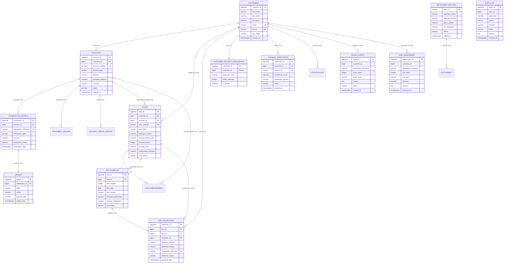

# 🏦 FinCore - Next-Gen Digital Banking & Settlement Platform

**FinCore** is an enterprise-grade digital banking system engineered with a decoupled multi-tier architecture. It features a responsive **Angular 18 frontend**, a high-throughput **Spring Boot 4 / Java 23 backend**, and a scalable **PostgreSQL database**.

---

## 📂 Repository Structure

```
├── Frontend/           # Angular 18 Single-Page Banking Application
├── Backend/            # Spring Boot REST API & Business Logic Engine
├── Database/           # PostgreSQL Master Schemas, Triggers, ER Diagram & Queries
├── .gitignore          # Root Git ignore configuration
└── README.md           # Master project overview & quickstart
```

---

## 📊 Database Architecture & Overall ER Diagram

The FinCore platform is backed by a PostgreSQL database structured across Core Banking, Amortized Loan Management, Interbank Settlement, and AI Biometric Security:



---

## 🌟 Key Platform Capabilities

1. **🏛️ Core Banking Operations**
   - Customer account lifecycle (Savings, Current, Term Deposits).
   - Automated double-entry ledger balancing with real-time credit/debit triggers.
   - Comprehensive account statement exports in PDF and Excel formats.

2. **💳 Loan Servicing & Collections Engine**
   - Loan origination, multi-tier approval workflows, and principal disbursement.
   - Reducing-balance EMI amortization calculator and repayment schedule tracker.
   - Automated collections receipt generation and delinquency penalty calculation.

3. **⚡ Interbank Settlement Engine**
   - Real-time gross settlement (RTGS) and multi-party net clearing batch execution.
   - Bank-to-bank balance reconciliation and settlement audit logs.

4. **🛡️ Real-Time Fraud Detection Engine**
   - High-speed rule evaluation based purely on transaction context (velocity, geofencing, IP anomalies, device signatures, authentication failures).
   - Immediate threat score computation (`SAFE`, `SUSPICIOUS`, `UNDER_REVIEW`, `BLOCKED`).
   - Live activity monitoring feed.

5. **👁️ Biometric KYC & Face Liveness Verification**
   - Client-side AI face mesh analysis powered by **Google MediaPipe Vision**.
   - Active user challenge detection (Blink, Turn Left/Right, Smile).
   - Tamper-proof verification certificate storage.

6. **📜 Enterprise Audit Trail**
   - Centralized, immutable audit logging capturing actor, action, timestamp, entity ID, and IP address.

---

## 🚀 Quick Start Guide

### 1. Database Setup
1. Open PostgreSQL (e.g. Supabase, AWS RDS, or local pgAdmin).
2. Execute the master schema:
   ```bash
   psql -h <HOST> -U <USERNAME> -d <DB> -f Database/fincore_master_schema.sql
   ```
   *Detailed guide: [Database/README.md](./Database/README.md)*

### 2. Backend Setup
1. Navigate to the backend directory:
   ```bash
   cd Backend
   ```
2. Configure database credentials in `src/main/resources/application.properties`.
3. Launch the Spring Boot application:
   ```powershell
   .\mvnw.cmd spring-boot:run
   ```
   *The backend will run on `http://localhost:8080`.*  
   *Detailed guide: [Backend/README.md](./Backend/README.md)*

### 3. Frontend Setup
1. Open a new terminal and navigate to the frontend directory:
   ```bash
   cd Frontend
   ```
2. Install dependencies and start the dev server:
   ```bash
   npm install
   npm start
   ```
3. Access the web interface at `http://localhost:4200`.  
   *Detailed guide: [Frontend/README.md](./Frontend/README.md)*

---

## 📚 Component Documentation

- 🌐 **[Frontend Documentation](./Frontend/README.md)** - Component architecture, UI routes, MediaPipe KYC, and export tools.
- ⚙️ **[Backend Documentation](./Backend/README.md)** - Spring Boot REST APIs, services, security, and endpoints.
- 🗄️ **[Database Documentation](./Database/README.md)** - Complete Mermaid ER Diagram, SQL schemas, entity relationships, triggers, and analytical queries.
