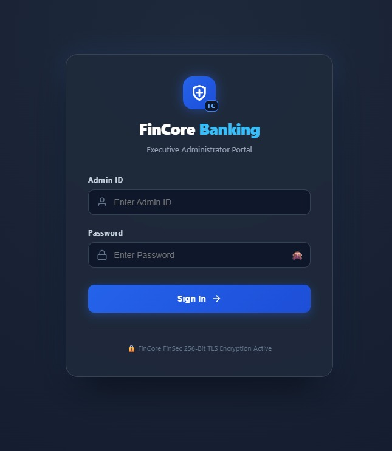

# 💳 FinCore Digital Banking Platform

## 📖 Overview

FinCore Digital Banking Platform is a full-stack banking application built using **Spring Boot**, **Angular**, and **PostgreSQL**. It provides secure banking services including user authentication, account management, fund transfers, balance management, transaction history, and PDF statement generation.

The application follows a layered architecture with Angular based UI, RESTful APIs, Spring Security, Hibernate, and JWT authentication to ensure secure and efficient banking operations. The project demonstrates real-world banking workflows while emphasizing scalability, maintainability, and secure application development.

---

## ✨ Features

### 🔐 Secure Authentication
- User registration and login
- JWT-based authentication and authorization
- Password encryption using BCrypt

### 👤 Customer Management
- Customer profile creation and management
- KYC status management
- Secure customer information storage

### 🏦 Account Management
- Create and manage bank accounts
- View account details
- Balance inquiry
- Account lifecycle management

### 📜 Statement Generation
- Generate account statements for a selected date range
- View transaction history
- Download statements in PDF format

### 🛡 Security
- Role-based access control
- Protected REST APIs
- Input validation and exception handling

### 💻 User Interface
- Responsive Angular frontend
- User-friendly dashboard
- Easy navigation for banking operations
---
## 🛠 Tech Stack
**Frontend**
- Angular
- TypeScript
- HTML
- CSS
  
**Backend**
- Java
- Spring Boot
- Spring Security
- Spring Data JPA
- PostgreSQL

**Database**
- PostgreSQL
---

## 📷 Application Screenshots

### 🔐 Login Page



---

### 👤 Account Details


---

### 🏦 Account Life Cycle


---

### 💰 Balance Management


---

### 📄 Statement Generation


---

### 🗄️ ER Diagram


---

## 📂 Project Structure

```
Backend/
Frontend/
Database
README.md
```

---

## ▶️ Running the Project

### Backend

```bash
cd Backend
mvn spring-boot:run
```

### Frontend

```bash
cd Frontend/MILESTONE1
npm install
ng serve
```

---

## 👥 Contributors

- Bharati Bhat
- Ramya Chava
- Janhvi Pandey
- Indu Patil
- Shanmukha Sai
- Raziya
