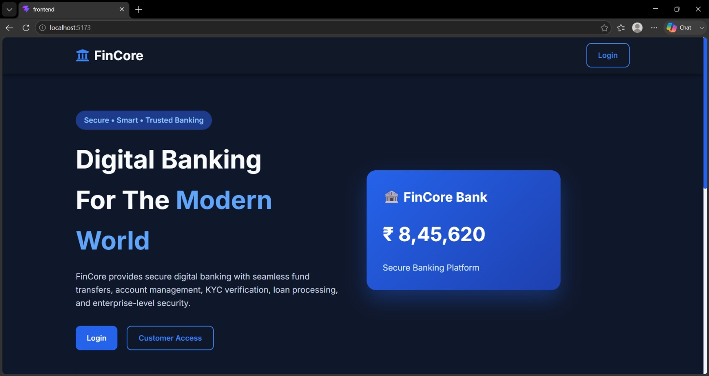
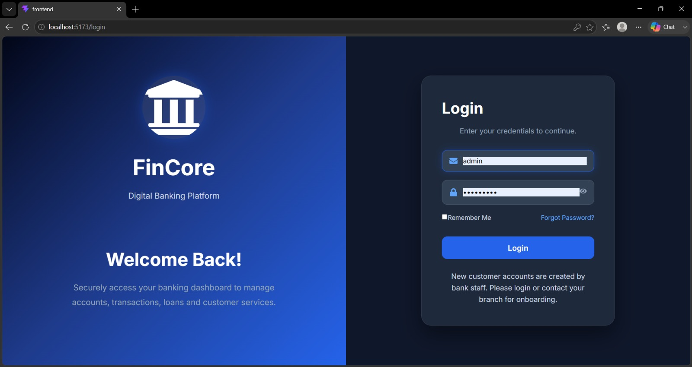
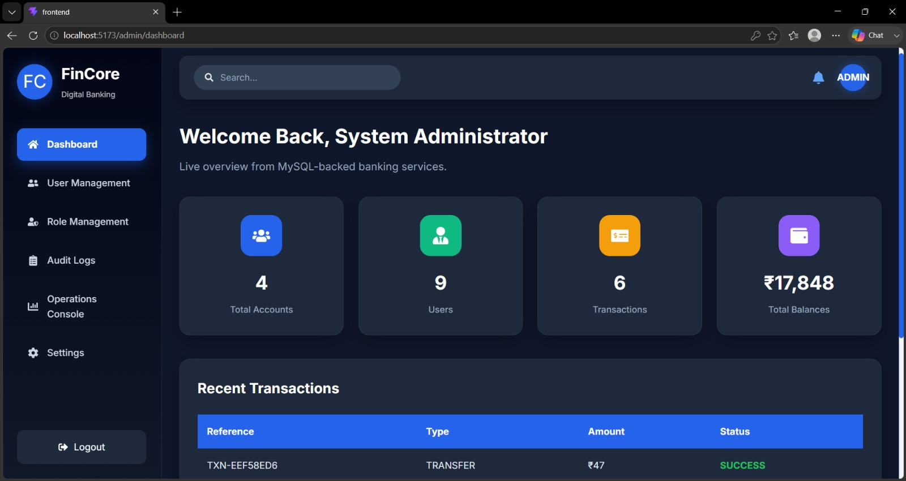
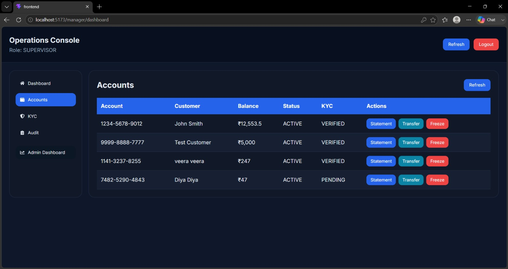
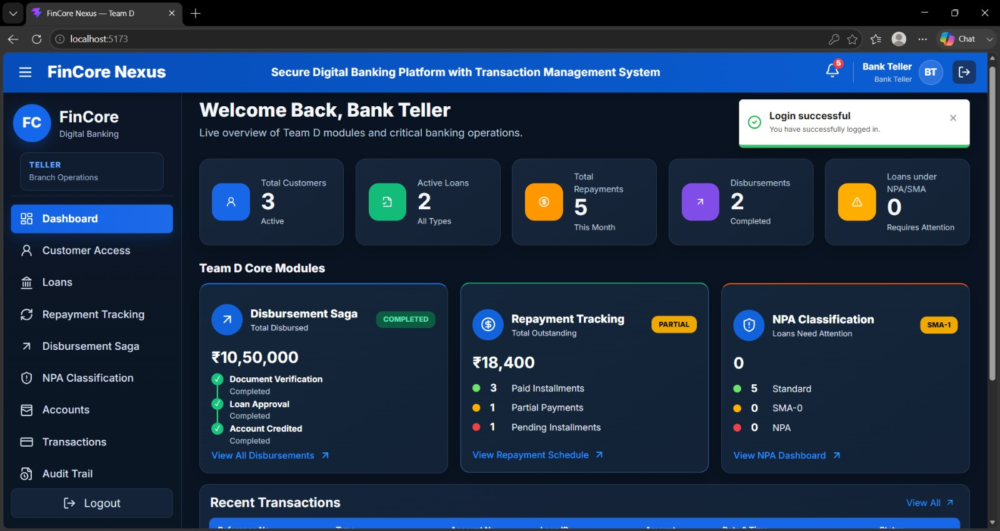
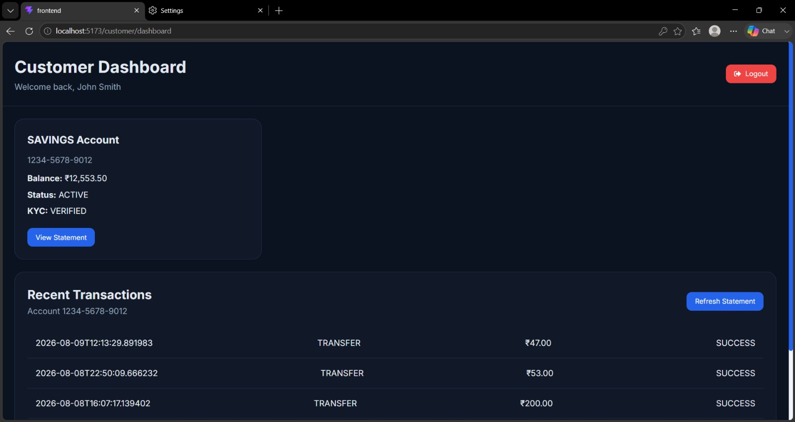

# 💳 FinCore Digital Banking Platform

## 📖 Overview

FinCore Digital Banking Platform is a full-stack digital banking application developed as part of Team D within the FinCore Nexus initiative. The project focuses on three core banking requirements: Role-Based Access Control (RBAC), KYC Verification, and Audit Trail Management.

The application follows a layered architecture with a React frontend, Spring Boot backend, JWT-based authentication, REST APIs, and MySQL database. It provides role-aware banking operations for Admin, Supervisor, Teller, and Customer users while maintaining secure access and traceable system activity.

## ✨ Features

### 🔐 Secure Authentication

* JWT-based authentication
* Secure login and authorization
* Role-based access control
* Protected REST APIs
* Failed login activity tracking

### 👥 Role-Based Access Control

* Admin role
* Supervisor role
* Teller role
* Customer role
* Role-specific dashboards and permissions
* Backend-side authorization

### 👤 User Management

* Admin user management
* User role management
* Account status management
* Role-aware navigation and operations

### 🪪 KYC Verification

* Customer information collection
* KYC document management
* Verification workflow
* Liveness / verification stage
* KYC status tracking
* PENDING and APPROVED statuses
* Dedicated KYC frontend module

### 🏦 Teller Operations

* View customer accounts
* View account information
* Statement operations
* Transfer operations
* View customer KYC records
* Role-restricted banking operations

### 📜 Audit Trail

* Centralized audit logging
* Login activity tracking
* Failed login tracking
* KYC activity tracking
* Account operation tracking
* Actor, action, entity, timestamp, and status tracking
* Searchable and sortable audit records

### 💻 User Interface

* React-based frontend
* Admin Dashboard
* Teller Operations Console
* User Management
* Role Management
* Audit Logs
* KYC Records
* Enterprise banking interface

## 🛠 Tech Stack

**Frontend**

* React
* JavaScript
* HTML5
* CSS3
* Frontend-KYC

**Backend**

* Java
* Spring Boot
* Spring Security
* REST APIs
* JWT
* Spring Data JPA

**Database**

* MySQL
* XAMPP / phpMyAdmin

**Development Tools**

* Git
* GitHub
* Maven
* npm
* IntelliJ IDEA
* Visual Studio Code

## 📷 Application Screenshots

### 🏠 Home Page



### 🔐 Login Page



### 👨‍💼 Admin Dashboard



### 👨‍💼 Supervisor Dashboard



### 🏦 Teller Dashboard



### 👤 User Dashboard



```text
React Frontend
      ↓
JWT Authentication
      ↓
Spring Boot REST APIs
      ↓
Business & Role Validation
      ↓
MySQL Database
```

### Request Flow

```text
User
  ↓
React Frontend
  ↓
JWT Bearer Token
  ↓
Spring Boot JWT Filter
  ↓
Controller
  ↓
Service Layer
  ↓
Role & Business Validation
  ↓
Repository
  ↓
MySQL Database
```

## 🔄 End-to-End Workflow

```text
Login
  ↓
JWT Issued
  ↓
Role Attached to Session
  │
  ├── Admin
  │     ├── User Management
  │     ├── Role Management
  │     ├── Audit Logs
  │     └── Settings
  │
  └── Teller
        └── Operations Console
              ├── View Accounts
              ├── Statements
              ├── Transfers
              └── KYC Records
```


## 📂 Project Structure

```text
fincore-digital-banking-platform/
│
├── Frontend/
│   └── Main React frontend
│
├── Frontend-KYC/
│   └── KYC frontend module
│
├── audittrail/
│   └── Audit Trail Spring Boot microservice
│
├── kyc-service/
│   └── KYC Spring Boot microservice
│
├── database/
│   ├── schema.sql
│   ├── queries.sql
│   └── sample_data.sql
│
├── Screenshots/
│   └── Application screenshots
│
└── README.md
```

## 🗄️ Database Components

The project uses MySQL for persistent data storage.

**Main Database Components**

* Users
* Roles
* Customers
* KYC Records
* Audit Logs

**Database Files**

```text
database/
│
├── schema.sql
├── queries.sql
└── sample_data.sql
```

## ▶️ Running the Project

### Backend

**Audit Trail Microservice**

```text
cd audittrail
.\mvnw.cmd spring-boot:run
```

Runs on:

```text
http://localhost:8081
```

**KYC Microservice**

```text
cd kyc-service
.\mvnw.cmd spring-boot:run
```

Runs on:

```text
http://localhost:8080
```

### Frontend

**Main Frontend**

```text
cd Frontend
npm install
npm run dev
```

Runs on:

```text
http://localhost:5173
```

**KYC Frontend**

```text
cd Frontend-KYC
npm install
npm run dev
```

Runs on:

```text
http://localhost:5174
```

### Database

Make sure MySQL is running on:

```text
localhost:3306
```

Username:

```text
root
```

Password:

```text
root
```

### Quick Summary

| Component     | Port |
| ------------- | ---- |
| MySQL         | 3306 |
| Audit Trail   | 8081 |
| KYC Service   | 8080 |
| Main Frontend | 5173 |
| KYC Frontend  | 5174 |

Keep all required services running while testing the complete application.

## 📌 Core Modules

| Module                | Description                            |
| --------------------- | -------------------------------------- |
| 🔐 RBAC               | Controls access based on user roles    |
| 🪪 KYC Verification   | Manages customer identity verification |
| 📜 Audit Trail        | Records and tracks system activities   |
| 👨‍💼 Admin Dashboard | Provides administrative management     |
| 🏦 Teller Operations  | Provides restricted banking operations |

## 🔐 Role-Based Access Control

### Admin

* Full system access
* User Management
* Role Management
* Audit Logs
* Settings
* System administration

### Supervisor

* Approval-level operations
* Oversight
* Elevated banking privileges

### Teller

* View accounts
* View KYC records
* Generate statements
* Initiate transfers
* Restricted from administrative operations

### Customer

* Self-service banking access
* Customer-specific operations


## 🔀 Version Control

Team D development is maintained in the shared **team-d** branch using Git and GitHub.

The branch contains:

* Frontend
* Frontend-KYC
* Audit Trail backend
* KYC backend
* Database
* Screenshots
* Documentation

## 👥 Team Contributions

| Team Member          | Responsibility     |
| -------------------- | ------------------ |
| Soumya Ranjan Puthal | Frontend Developer |
| Vaishnavi Mahadik    | Frontend Developer |
| Thejashree B         | Frontend Developer |
| Tharun M             | Frontend Developer |
| Sathiya Priya T      | Backend Developer  |
| Sharvari Shalgar     | Backend Developer  |
| Vaishnavi Warkar     | Database Developer |

## 📝 Conclusion

Team D has implemented core digital banking capabilities covering **Role-Based Access Control, KYC Verification, and Audit Trail Management**.

The platform provides separate experiences for administrative and Teller users, ensuring that users can access only the functionality permitted by their assigned roles.

The KYC module provides a structured customer verification workflow with explicit status tracking, while the Audit Trail provides centralized visibility into important system activities.

The modular frontend, backend, microservices, and database structure provides a strong foundation for further development and future production hardening.

> **"Authenticate securely, act within role, and record everything."**

## 📌 Project Information

| Information    | Details                          |
| -------------- | -------------------------------- |
| Project        | FinCore Digital Banking Platform |
| Team           | Team D                           |
| Branch         | team-d                           |
| Frontend       | React                            |
| Backend        | Spring Boot                      |
| Database       | MySQL                            |
| Authentication | JWT                              |
| Audit Trail    | localhost:8081                   |
| KYC Service    | localhost:8080                   |
| Main Frontend  | localhost:5173                   |
| KYC Frontend   | localhost:5174                   |
| MySQL          | localhost:3306                   |

## 👥 Contributors

* **Soumya Ranjan Puthal** — Frontend Developer
* **Vaishnavi Mahadik** — Frontend Developer
* **Thejashree B** — Frontend Developer
* **Tharun M** — Frontend Developer
* **Sathiya Priya T** — Backend Developer
* **Sharvari Shalgar** — Backend Developer
* **Vaishnavi Warkar** — Database Developer
