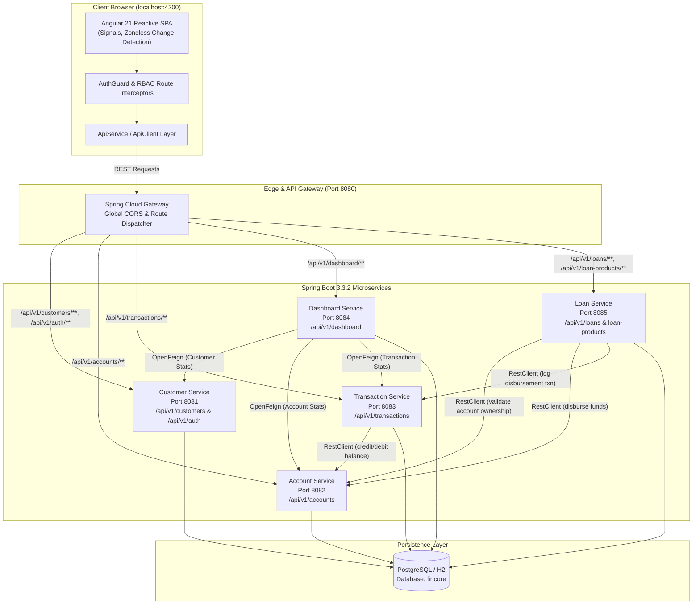
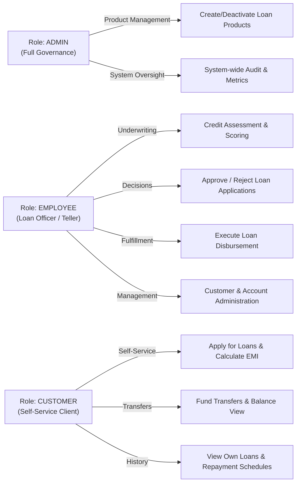
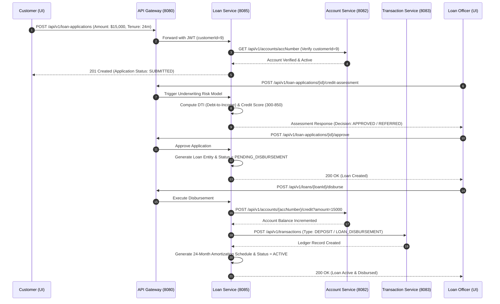
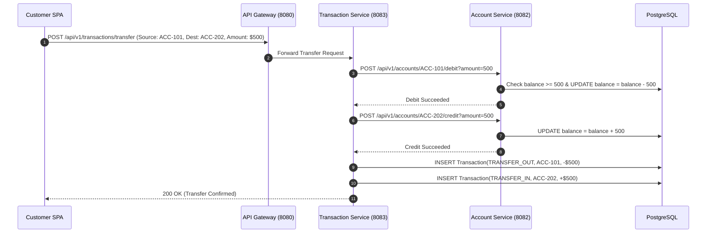
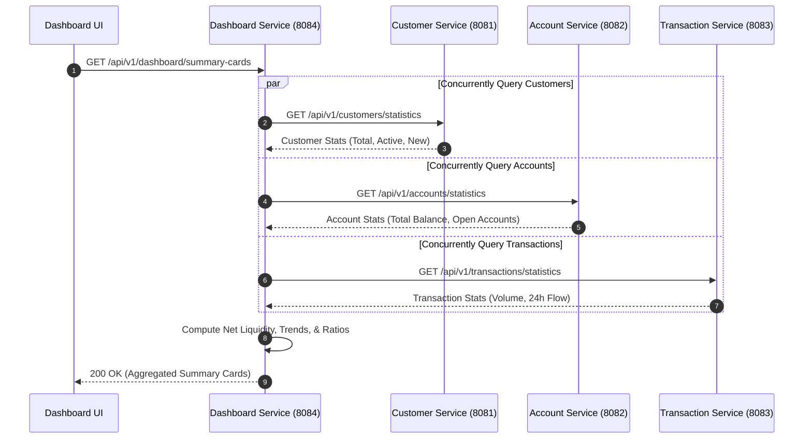

# FinCore - Digital Banking & Financial Microservices Platform

Welcome to **FinCore**, a full-stack, enterprise-grade digital banking microservices platform engineered for high-throughput, fault-tolerant, and secure financial operations. 

FinCore implements core retail and corporate banking primitives including **Customer KYC Onboarding**, **Account Lifecycle Management**, **Double-Entry Transaction Processing**, **Automated Multi-Factor Loan Underwriting & Disbursement**, and a **Resilient Aggregated Executive Dashboard**, fronted by a reactive **Angular 21 Single Page Application (SPA)**.

---

## 1. System Architecture & Topology

FinCore is engineered as a decoupled, domain-driven distributed microservices platform built on **Spring Boot 3.3.2**, **Spring Cloud Gateway**, and **PostgreSQL**, connected to an **Angular 21 Zoneless Reactive Frontend**.



---

## 2. Microservice Port & Service Catalog

| Service Name | Port | Base Routing Path | Primary Responsibilities | Dependencies |
| :--- | :---: | :--- | :--- | :--- |
| **API Gateway** | `8080` | `http://localhost:8080/` | Unified routing, global CORS filter, token pass-through | Spring Cloud Gateway |
| **Customer Service** | `8081` | `http://localhost:8081/api/v1/customers`<br/>`http://localhost:8081/api/v1/auth` | User auth (JWT), Customer KYC onboarding, profile search | PostgreSQL (`customers`, `users`) |
| **Account Service** | `8082` | `http://localhost:8082/api/v1/accounts` | Account creation, status management, balance credit/debit | PostgreSQL (`accounts`) |
| **Transaction Service** | `8083` | `http://localhost:8083/api/v1/transactions` | Double-entry transfers, deposits, withdrawals, ledger | PostgreSQL (`transactions`), Account Service |
| **Dashboard Service** | `8084` | `http://localhost:8084/api/v1/dashboard` | KPI aggregation, cashflow trends, resilient metrics | OpenFeign to Ports 8081, 8082, 8083 |
| **Loan Service** | `8085` | `http://localhost:8085/api/v1/loans`<br/>`http://localhost:8085/api/v1/loan-products` | Loan lifecycle, credit assessment, disbursement, schedule | PostgreSQL (`loans`, `loan_products`), Ports 8082, 8083 |
| **Frontend UI** | `4200` | `http://localhost:4200` | Zoneless Angular SPA, RBAC interfaces, real-time health | Node.js 20+, Angular Material |

---

## 3. Role-Based Access Control (RBAC) & Security Architecture

FinCore implements end-to-end security using **Stateless HMAC-SHA256 JWT** tokens. Claims are verified across all microservices via a dedicated `JwtAuthFilter` that populates a thread-local `UserContext`.

### 3.1 Roles Matrix & Permissions



| Feature / Action | `ADMIN` | `EMPLOYEE` | `CUSTOMER` |
| :--- | :---: | :---: | :---: |
| **View Dashboard & System KPIs** | :white_check_mark: | :white_check_mark: | :white_check_mark: (Personalized) |
| **Create & Update Customer Profiles** | :white_check_mark: | :white_check_mark: | :x: |
| **Open Accounts & Freeze/Close Accounts**| :white_check_mark: | :white_check_mark: | :x: |
| **Execute Intra/Inter-bank Transfers** | :white_check_mark: | :white_check_mark: | :white_check_mark: (Own accounts only) |
| **Create/Deactivate Loan Products** | :white_check_mark: | :x: | :x: |
| **Submit Loan Application** | :white_check_mark: | :white_check_mark: | :white_check_mark: (Bound to customer ID) |
| **Run Credit Assessment Algorithm** | :white_check_mark: | :white_check_mark: | :x: (Enforced 403 Forbidden) |
| **Approve or Reject Loan Applications**| :white_check_mark: | :white_check_mark: | :x: (Enforced 403 Forbidden) |
| **Disburse Loan Funds** | :white_check_mark: | :white_check_mark: | :x: (Enforced 403 Forbidden) |
| **Repay Loan EMI / Foreclosure** | :white_check_mark: | :white_check_mark: | :white_check_mark: |

### 3.2 Demo Profiles & Credentials

| Username | Password | Role | Customer/Employee ID | Primary Use Case |
| :--- | :--- | :---: | :---: | :--- |
| `admin` | `admin123` | `ADMIN` | — | System administration, loan product configuration |
| `employee` | `employee123` | `EMPLOYEE` | `employeeId = 1` | Loan underwriting, KYC reviews, manual disbursements |
| `customer` | `customer123` | `CUSTOMER` | `customerId = 9` | Self-service banking, applications, fund transfers |

### 3.3 Security Invariants & Insecure Direct Object Reference (IDOR) Defenses
1. **Ownership Enforcement**: A customer can only apply for loans using accounts owned by their verified `customerId`. Attempts to apply using other accounts return `403 Forbidden`.
2. **Payload Tampering Protection**: If a client sends a manipulated `customerId` in the request body, the backend overrides or strictly enforces the identity extracted from the verified JWT token.
3. **State Machine Invariants**: 
   - A loan application can only be approved if it is in `SUBMITTED` or `UNDER_REVIEW` status.
   - Disbursement can only occur once for loans in `PENDING_DISBURSEMENT` status; duplicate disbursements are strictly blocked.
   - Rejected applications cannot be approved or disbursed.

---

## 4. Key Financial Workflows & Architectural Mechanics

### 4.1 Loan Lifecycle: Application $\rightarrow$ Credit Risk Assessment $\rightarrow$ Approval $\rightarrow$ Disbursement



---

### 4.2 Double-Entry Fund Transfer Architecture

When initiating an inter-account transfer, `TransactionService` guarantees ledger consistency across accounts:



---

### 4.3 Resilient Dashboard Aggregation Engine

`DashboardService` orchestrates parallel RPC requests across downstream services using declarative **Spring Cloud OpenFeign** clients with fallback error isolation:



---

## 5. Financial Mathematics & Algorithms

### 5.1 Equated Monthly Installment (EMI) Formula
Monthly repayment amounts are computed using standard amortization mechanics:

$$E = P \cdot r \cdot \frac{(1 + r)^n}{(1 + r)^n - 1}$$

Where:
- $P$ = Principal loan amount
- $r$ = Monthly interest rate ($\text{Annual Rate} / 12 / 100$)
- $n$ = Loan tenure in months

### 5.2 Debt-To-Income (DTI) Ratio & Underwriting Risk Bands
The automated credit risk assessment engine evaluates customer financial capacity:

$$\text{DTI} = \left( \frac{\text{Monthly Expenses} + \text{Proposed EMI}}{\text{Monthly Income}} \right) \times 100$$

- **DTI $\le$ 35%**: Prime rating $\rightarrow$ Automatic credit score boost (+50 pts)
- **35% < DTI $\le$ 50%**: Moderate rating $\rightarrow$ Neutral score adjustment
- **DTI > 50%**: High risk $\rightarrow$ Recommended rejection or referral

---

## 6. Complete API Reference

### 6.1 Authentication & KYC (`customer-service` : `8081` / Gateway : `8080`)
- `POST /api/v1/auth/login`: Authenticate and obtain JWT token.
- `GET /api/v1/customers`: Search and list customer profiles (paginated).
- `GET /api/v1/customers/{id}`: Retrieve customer details by ID.
- `POST /api/v1/customers`: Onboard new customer.
- `PUT /api/v1/customers/{id}`: Update customer profile.
- `GET /api/v1/customers/statistics`: Aggregated customer counts.

### 6.2 Accounts Management (`account-service` : `8082` / Gateway : `8080`)
- `GET /api/v1/accounts`: List accounts (supports `?customerId={id}`).
- `GET /api/v1/accounts/{accountNumber}`: Retrieve account by account number.
- `POST /api/v1/accounts`: Open a new bank account.
- `POST /api/v1/accounts/{accountNumber}/credit?amount={val}`: Atomic balance credit.
- `POST /api/v1/accounts/{accountNumber}/debit?amount={val}`: Atomic balance debit.
- `PATCH /api/v1/accounts/{accountNumber}/status`: Change status (`ACTIVE`, `FROZEN`, `CLOSED`).

### 6.3 Transactions & Ledger (`transaction-service` : `8083` / Gateway : `8080`)
- `GET /api/v1/transactions`: Search transactions with date/type filters.
- `POST /api/v1/transactions/deposit`: Deposit cash into account.
- `POST /api/v1/transactions/withdraw`: Withdraw cash from account.
- `POST /api/v1/transactions/transfer`: Inter-account transfer.
- `GET /api/v1/transactions/statistics`: Transaction metrics and flow totals.

### 6.4 Loans & Underwriting (`loan-service` : `8085` / Gateway : `8080`)
- `GET /api/v1/loan-products`: List available loan products.
- `POST /api/v1/loan-products`: (Admin) Create loan product catalog item.
- `PATCH /api/v1/loan-products/{id}/status`: (Admin) Activate/deactivate product.
- `POST /api/v1/loans/calculate-emi`: Calculate EMI without persisting.
- `POST /api/v1/loan-applications`: Submit loan application.
- `GET /api/v1/loan-applications`: View application queue.
- `POST /api/v1/loan-applications/{id}/credit-assessment`: Trigger risk scoring.
- `POST /api/v1/loan-applications/{id}/approve`: Approve application.
- `POST /api/v1/loan-applications/{id}/reject`: Reject application with reason.
- `POST /api/v1/loans/{id}/disburse`: Disburse funds to target account.
- `GET /api/v1/loans/{id}/repayment-schedule`: Generate amortization schedule.
- `POST /api/v1/loans/{id}/repay`: Execute EMI payment.

### 6.5 Executive Dashboard (`dashboard-service` : `8084` / Gateway : `8080`)
- `GET /api/v1/dashboard/summary-cards`: High-level aggregated metric cards.
- `GET /api/v1/dashboard/transaction-trend`: Historical cashflow trends.
- `GET /api/v1/dashboard/account-distribution`: Account type distribution metrics.

---

## 7. Operational Run & Developer Setup Guide

### 7.1 System Prerequisites
- **Java Development Kit (JDK)**: Version 17 or higher (`java -version`)
- **Node.js**: Version 20 or higher (`node -v`)
- **PostgreSQL Database**: Running on `localhost:5432` with database `fincore` (credentials: `postgres` / `root123` or configured in properties)
- **Python**: Version 3.9+ (for automated end-to-end testing)

---

### 7.2 Database Setup
```sql
-- Connect to PostgreSQL and create database
CREATE DATABASE fincore;
```
> [!NOTE]
> Hibernate `ddl-auto=update` is enabled across all services, meaning database tables are automatically initialized on service boot.

---

### 7.3 Building the Entire Backend
From the multi-module root directory:
```powershell
cd d:\Desktop\fincore\fin-backend\bacjend
.\mvnw.cmd clean package -DskipTests
```

---

### 7.4 Launching the Microservices (Terminal Run Order)

Start each service in a separate terminal:

#### Terminal 1 — Customer Service (Port 8081)
```powershell
cd d:\Desktop\fincore\fin-backend\bacjend\customer-service
..\mvnw.cmd spring-boot:run
```

#### Terminal 2 — Account Service (Port 8082)
```powershell
cd d:\Desktop\fincore\fin-backend\bacjend\account-service
..\mvnw.cmd spring-boot:run
```

#### Terminal 3 — Transaction Service (Port 8083)
```powershell
cd d:\Desktop\fincore\fin-backend\bacjend\transaction-service
..\mvnw.cmd spring-boot:run
```

#### Terminal 4 — Dashboard Service (Port 8084)
```powershell
cd d:\Desktop\fincore\fin-backend\bacjend\dashboard-service
..\mvnw.cmd spring-boot:run
```

#### Terminal 5 — Loan Service (Port 8085)
```powershell
cd d:\Desktop\fincore\fin-backend\bacjend\loan-service
..\mvnw.cmd spring-boot:run
```

#### Terminal 6 — API Gateway (Port 8080)
```powershell
cd d:\Desktop\fincore\fin-backend\bacjend\api-gateway
..\mvnw.cmd spring-boot:run
```

#### Terminal 7 — Angular Frontend (Port 4200)
```powershell
cd d:\Desktop\fincore\fin-final\fincore-frontend
npm install
npm start
```
Access the application at `http://localhost:4200`.

---

### 7.5 Automated End-to-End Test Suite

A comprehensive end-to-end test script validates the entire platform including multi-service startup, identity claims, loan underwriting, fund disbursement, double-entry ledger audits, and IDOR vulnerability boundaries:

```powershell
cd d:\Desktop\fincore\fin-backend
python test_e2e_full.py
```

---

### 7.6 Service Health & Swagger Documentation

| Service | Health Check Endpoint | Swagger UI |
| :--- | :--- | :--- |
| **API Gateway** | `http://localhost:8080/actuator/health` | — |
| **Customer Service** | `http://localhost:8081/actuator/health` | `http://localhost:8081/swagger-ui.html` |
| **Account Service** | `http://localhost:8082/actuator/health` | `http://localhost:8082/swagger-ui.html` |
| **Transaction Service** | `http://localhost:8083/actuator/health` | `http://localhost:8083/swagger-ui.html` |
| **Dashboard Service** | `http://localhost:8084/actuator/health` | `http://localhost:8084/swagger-ui.html` |
| **Loan Service** | `http://localhost:8085/actuator/health` | `http://localhost:8085/swagger-ui.html` |

---

## 8. Directory Structure

```
d:\Desktop\fincore\
├── README.md                                 <-- System Architecture & Operations Guide
├── fin-backend/
│   ├── test_e2e_full.py                      <-- Comprehensive End-to-End Test Suite
│   └── bacjend/                              <-- Maven Multi-module Backend
│       ├── pom.xml                           <-- Multi-module orchestrator
│       ├── api-gateway/                      <-- Port 8080 (Spring Cloud Gateway & CORS)
│       ├── customer-service/                 <-- Port 8081 (KYC, Auth, Profile)
│       ├── account-service/                  <-- Port 8082 (Account Lifecycle, Balance)
│       ├── transaction-service/              <-- Port 8083 (Ledger, Transfers)
│       ├── dashboard-service/                <-- Port 8084 (Metrics Aggregator)
│       └── loan-service/                     <-- Port 8085 (Underwriting & Disbursement)
│
└── fin-final/
    └── fincore-frontend/                     <-- Angular 21 Zoneless Reactive SPA
        ├── src/environments/                 <-- Service URLs & Gateway Config
        ├── src/app/core/                     <-- Guards, Interceptors, Models, Services
        └── src/app/features/                 <-- Dashboard, Customer, Account, Transaction, Loan, Admin
```
